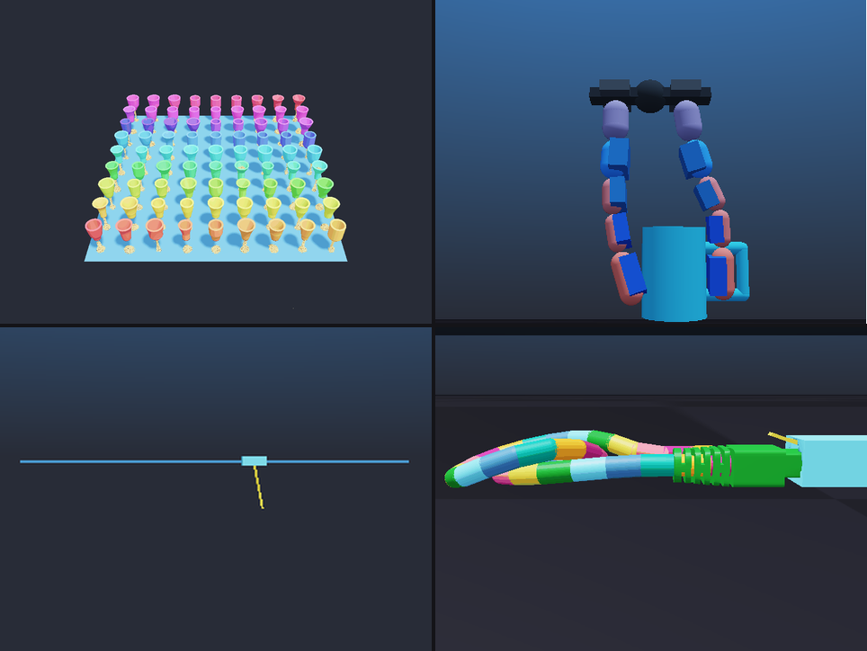

<!-- markdownlint-disable MD033 MD043 -->
# Newton + PhysicsNeMo integration examples

PhysicsNeMo gives you reusable tools for turning a physics simulator into a
learning and optimization engine. These examples show how to use those tools with
[**Newton**](https://github.com/newton-physics/newton), a GPU-accelerated physics
engine built on Warp, and they exist to showcase why PhysicsNeMo is useful in
practice.

The division of labor is simple: Newton owns the world and the time-stepping,
while PhysicsNeMo owns the models, training, reusable optimization and learning
workflows, and deployment paths. Live Newton fields cross the learning boundary
as zero-copy Warp-to-Torch views, and everything else (reporting, plotting, and
your own application logic) stays ordinary Python.

The reusable API currently lives under `physicsnemo.experimental` and may still
change as the integration matures.

Every example here lives inside PhysicsNeMo and changes nothing in Newton. Some
adapt stock Newton scenes, others build a problem-specific scene locally, and
[Bring your own Newton scene](#bring-your-own-newton-scene) shows how to do
either with your own physics. The reusable machinery lives in the
[PhysicsNeMo Newton integration API](https://docs.nvidia.com/physicsnemo/latest/physicsnemo/api/physicsnemo.experimental.integrations.newton.html),
so each example only declares the physics-specific pieces (the observation, the
loss, the design parameters).



## New to both Newton and PhysicsNeMo? Start here

The two libraries have separate jobs:

| Library | What it does |
| --- | --- |
| **Newton** | Simulates the physical world. It owns geometry, mass, joints, materials, collision/contact handling, and the numerical solver that advances time. |
| **PyTorch** | Supplies tensors, neural-network primitives, autograd, losses, and optimizers. |
| **PhysicsNeMo** | Builds on PyTorch with scientific model architectures, data pipelines, distributed training, and reusable physics-AI workflows. |
| **This integration** | Connects Newton's live device state to PhysicsNeMo/PyTorch, then supports training, evaluation, and learned deployment. |

PhysicsNeMo is not a replacement for PyTorch, and it does not silently replace
Newton's physics. A PhysicsNeMo model is a normal `torch.nn.Module`. The
*teacher* is the ground-truth solver run that generates training data; during
teacher generation and validation, Newton remains the source of truth.

### The Newton physics loop

A Newton simulation has a few important pieces:

| Newton object | Meaning |
| --- | --- |
| `model` | Mostly fixed bodies, particles, shapes, masses, joints, and materials |
| `state` | Positions, orientations, and velocities at one instant |
| `control` | Actuator targets, forces, or other inputs for a step |
| collision pipeline / `contacts` | Interactions found for the current state |
| `solver` | Numerical method that advances `state_in` to `state_out` |

Conceptually, Newton evaluates:

```text
next_state = solver(state, control, contacts, dt)
```

A displayed frame can contain several smaller solver **substeps**. Increasing
substeps can improve numerical stability or contact resolution, but costs more.
Newton can also replicate one scene into many parallel **worlds** -- independent
copies of the same physics, batched on one device and advanced by a single
solver call. `NewtonEnv` owns this reset/step/rollout loop while still calling
the Newton solver and collision pipeline you selected.

The state fields depend on the physics:

| Physics | Newton fields | Readable integration view |
| --- | --- | --- |
| Particles, soft bodies, MPM | `particle_q`, `particle_qd` | `particles(state).positions`, `.velocities` |
| Rigid bodies and cable segments | `body_q`, `body_qd` | `bodies(state).positions`, `.orientations`, `.spatial_velocities` |
| Articulated robots | `joint_q`, `joint_qd` | `joints(state).coordinates`, `.velocities` |

These readable properties are live Torch views over Newton's Warp arrays. A
read does not require a host copy, and writing through a setter changes the
simulation state.

You don't need to write Warp kernels for normal rollouts, datasets,
[Neural Robot Dynamics (NeRD)](./nerd/) training, or simulator-as-oracle
optimization. Newton uses Warp internally, but
the integration presents the learning boundary as Torch tensors. In practice you
provide a Newton scene, an observation, a distribution of initial
conditions/controls, and a task metric, and PhysicsNeMo provides the rest: the
lifecycle, data bridge, model/training workflow, distributed synchronization,
evaluation, and deployment adapters.

### Smallest complete rollout

Install the integration first (see
[Shared run environment](#shared-run-environment) below; in short,
`pip install "nvidia-physicsnemo[newton]"` or `uv sync --extra newton` from a
checkout). This then loads a stock Newton scene headlessly, reads its particle
state as a Torch observation, and advances 60 frames:

```python
import torch
from newton.examples.diffsim.example_diffsim_ball import Example as BallScene

from physicsnemo.experimental.integrations.newton import (
    NewtonEnv,
    particles,
)


def observe(state):
    ball = particles(state)
    return torch.cat((ball.positions[0], ball.velocities[0]))


env = NewtonEnv.from_example(
    BallScene,
    observe=observe,
    substeps=4,
    collide_on_reset=True,
    # This stock scene authors its ground-plane contacts once at reset and
    # reuses them, so skip per-substep recollision.
    collide_each_substep=False,
)
initial = env.reset()
rollout = env.rollout(steps=60)

print(initial.shape)               # torch.Size([6])
print(rollout.observations.shape)  # torch.Size([61, 6])
```

Newton builds and advances the ball scene. PhysicsNeMo provides the headless
scene adapter, lifecycle, readable zero-copy state, and Torch trajectory. The
`observe` function is intentionally plain Python: it defines exactly which
physical values the learning problem sees. `from_example(...)` builds the
example headlessly and wraps it via `from_scene(...)`, which resets from the
scene's authored initial state and refreshes contacts before every substep when
a collision pipeline is available. A one-shot contact is computed once (here,
against the fixed ground plane at reset) and reused for the whole rollout
instead of being recomputed every substep. Because this stock ball scene authors
such contacts, pass `collide_each_substep=False` to skip per-substep
recollision; for scenes whose contacts change during a step, leave it at its
default (true when the scene has a collision pipeline).

Changing live physics state is similarly direct:

```python
env.reset()
particles(env.state).velocities = torch.tensor(
    [[0.0, 5.0, -5.0]], device=initial.device
)
new_rollout = env.rollout(steps=60)
```

### Where learning begins

For a basic next-step model, PhysicsNeMo turns trajectories into normalized
windows and provides a reusable model, while the loss and optimizer remain
ordinary PyTorch:

```python
import torch
import torch.nn.functional as F
from physicsnemo.datapipes import DataLoader
from physicsnemo.experimental.integrations.newton import ResidualDynamics, trajectory_dataset

dataset = trajectory_dataset(rollout.observations, window=8, predict_steps=1)
loader = DataLoader(dataset, batch_size=32)
model = ResidualDynamics.mlp(state_dim=6).to(initial.device)
optimizer = torch.optim.AdamW(model.parameters(), lr=1.0e-3)

for batch in loader:
    prediction = model(batch["input"][:, -1])
    loss = F.mse_loss(prediction, batch["target"][:, 0])
    optimizer.zero_grad()
    loss.backward()
    optimizer.step()
```

`ResidualDynamics` is the plain per-step residual model; the diffsim example
wraps this same model in `BPTTSurrogate` to add free-running rollout training
with BPTT (backpropagation through time -- the rollout loss is backpropagated
through the model's own predicted states).

The examples below use higher-level workflows when the problem needs
feedback through a learned rollout ([diffsim](./diffsim/)),
simulator-as-oracle design optimization ([nozzle](./nozzle/)), or learned
dynamics that condition on a causal history (the recent window of past states
the model sees) and deploy as a replacement solver step ([nerd](./nerd/)). The
full beginner-oriented API guide is the
[Newton integration documentation](https://docs.nvidia.com/physicsnemo/latest/physicsnemo/api/physicsnemo.experimental.integrations.newton.html).

## Bring your own Newton scene

The contact-rich RJ45 example adapts a scene from `newton.examples`; the
cart-pole, gripper, and nozzle examples build their Newton scenes locally. Your
own physics works through either route because PhysicsNeMo does not require a
custom scene type. It reads a small set of attributes from the scene object you
provide.

### What PhysicsNeMo needs from a scene

`NewtonEnv` looks for a small, duck-typed set of attributes on the scene:

| Attribute | Required? | Purpose |
| --- | --- | --- |
| `model` | Yes | The Newton `Model`: bodies, particles, shapes, joints, and materials |
| `solver` | Yes | The numerical solver that advances the state |
| `state_0` (or `states[0]`) | Optional | Authored initial state restored on `reset()` |
| `control` | Optional | Per-step control buffer (actuator targets, forces) |
| `contacts`, `pipeline` (or `collision_pipeline`) | Optional | Contacts and the collision pipeline |
| `sim_substeps` + `sim_dt` (or `frame_dt`) | Optional | Timing, used to preserve the frame duration |

Only `model` and `solver` are mandatory. Anything else that is missing is simply
skipped, and PhysicsNeMo falls back to sensible defaults (for example,
allocating fresh state buffers on every `reset()`).

### Option A: write a Newton `Example` class

A Newton example is just a class whose `__init__(self, viewer, args)` builds the
world. PhysicsNeMo constructs it headlessly for you, passing Newton's no-op
`ViewerNull`, so you never open a window or perform graph capture:

```python
import newton
import torch

from physicsnemo.experimental.integrations.newton import NewtonEnv, bodies


class MyScene:
    def __init__(self, viewer, args=None):
        builder = newton.ModelBuilder()
        # ... add bodies/particles/joints/shapes and set the initial state ...
        self.model = builder.finalize()
        self.solver = newton.solvers.SolverSemiImplicit(self.model)
        self.state_0 = self.model.state()
        self.state_1 = self.model.state()
        self.control = self.model.control()
        self.sim_substeps = 4
        self.sim_dt = (1.0 / 60.0) / self.sim_substeps


def observe(state):
    rig = bodies(state)
    return torch.cat((rig.positions.reshape(-1), rig.linear_velocities.reshape(-1)))


env = NewtonEnv.from_example(MyScene, observe=observe)
env.reset()
trajectory = env.rollout(steps=120).observations
```

To add command-line options, give the class a `create_parser()` classmethod
that returns an `argparse.ArgumentParser`. `from_example` parses it with no
arguments, and you can override individual values with `arg_overrides={...}`.
Stock Newton examples that perform graph capture in `__init__` work unchanged,
because the headless loader skips that capture and drives its own rollouts.

### Option B: skip the class and wrap a model or scene directly

You do not actually need the `Example` convention. If you already have a built
scene object, pass it to `NewtonEnv.from_scene(...)`. If you only have a Newton
`model`, hand it to `NewtonEnv.from_model(...)`, which attaches a default
`SolverSemiImplicit` and builds a collision pipeline when the model has shapes.

| Starting point | Use this | Notes |
| --- | --- | --- |
| A class from `newton.examples`, or your own following the convention | `NewtonEnv.from_example(MyScene, ...)` | Built headlessly for you |
| An already-constructed scene object | `NewtonEnv.from_scene(scene, ...)` | Reads the attributes in the table above |
| A bare Newton `model` | `NewtonEnv.from_model(model, ...)` | Adds a default solver and collisions |

### From your scene to a learning workflow

Once your scene is wrapped in a `NewtonEnv`, its lifecycle and live state can be
reused across the workflows in this folder. Each workflow still needs its
problem-specific boundary: differentiable rollouts require a differentiable
solver configuration and loss, surrogate fitting needs observations and
targets, and NeRD needs state/input adapters plus reset randomization. The
[nerd](./nerd/) example shows the most complete version of that pattern.

## Examples

Each folder contains the full problem explanation, commands, results, figures,
and method references. The right column names the Newton solver and physics
each example exercises (Featherstone, XPBD, VBD, and implicit MPM are Newton's
articulation, position-based, vertex-block-descent, and material-point
solvers).

| Example | What it demonstrates | Newton physics |
| --- | --- | --- |
| [diffsim](./diffsim/) | Improve free-running surrogate dynamics with rollout BPTT | Force-driven Featherstone cart-pole |
| [gripper](./gripper/) | Offline geometry-only co-design of a fixed-topology two-finger gripper's proportions, pre-curvature, and pads through a PointNet surrogate | Batched articulated XPBD grasping |
| [nozzle](./nozzle/) | Optimize a design with Newton as a simulator oracle | Non-differentiable implicit-MPM nozzle flow |
| [nerd](./nerd/) | Replace Newton solver steps with NeRD across different state representations | Featherstone cart-pole and contact-rich VBD RJ45 cable |

## Shared run environment

For an installed PhysicsNeMo package, install the Newton integration with the
CUDA backend matching the host:

```bash
pip install "nvidia-physicsnemo[cu13,newton]"   # or [cu12,newton]
```

Plain `nvidia-physicsnemo[newton]` also works and uses the default PyPI Torch
backend. The extra includes Newton's simulator, importer, viewer, and
bundled-example dependencies. From a PhysicsNeMo source checkout:

```bash
uv sync --extra cu13 --extra newton   # or --extra cu12
```

Run any example from the PhysicsNeMo repository root:

```bash
uv run python examples/newton/diffsim/example_diffsim_cartpole_bptt.py
uv run python examples/newton/gripper/example_gripper_design.py
uv run python examples/newton/nozzle/example_mpm_nozzle_design.py
uv run python examples/newton/nerd/example_cartpole_nerd.py --smoke
uv run python examples/newton/nerd/example_rj45_nerd.py --smoke
```

To test against an uninstalled Newton source checkout, prepend
`PYTHONPATH=/path/to/newton` to the same commands.

**Hardware and runtime expectations.** The examples assume one CUDA GPU; the
`--smoke` presets finish in seconds to a minute and exist to verify the
pipeline. Unflagged defaults are real GPU jobs -- the NeRD cart-pole default is
roughly 40 minutes on one data-center GPU, and the per-folder READMEs record
measured budgets for the larger runs. Outputs land inside each example folder
(`examples/newton/<example>/outputs/`). Training and optimization scripts write
reports and scorecards; plotting and rendering utilities write the figures or
GIFs named in their help text. Pass `--help` for the full flag list. The
per-folder READMEs provide reduced commands where available.

## The integration library

`physicsnemo.experimental.integrations.newton` is optional and imports without Newton
installed:

- **Scene and lifecycle.** `NewtonEnv.from_example(ExampleClass, ...)` builds and
  wraps a stock Newton example headlessly. `NewtonEnv` drives `reset(**fields)`
  and `rollout(...)`. An observation is a plain `state -> Tensor` callable.
- **Zero-copy data.** `field_to_torch` exposes live Warp arrays as Torch views,
  and the readable state views below provide named setters.
- **Readable state views.** `particles(state)`, `bodies(state)`, and
  `joints(state)` give Newton's packed Warp arrays obvious names as live,
  zero-copy Torch tensors:

  ```python
  from physicsnemo.experimental.integrations.newton import bodies

  rod = bodies(state)
  rod.positions            # (N, 3) Torch view, no copy
  rod.linear_velocities    # (N, 3), the v-part of the 6-vector body_qd
  ```

- **Differentiable rollout.** `differentiable_rollout(env,
  steps=..., loss_fn=..., field=...)` runs a Warp-tape rollout and
  returns the trajectory, the adjoint (the gradient of the loss with respect
  to the chosen initial-state field, from Warp's tape), and the loss.
- **Surrogate training.** `BPTTSurrogate` trains `ResidualDynamics` with
  one-step supervision plus a free-running rollout loss backpropagated through
  predicted states.
- **Design optimization.** `optimize_design(...)` supports simulator-as-oracle
  queries, while `optimize_grouped_design(...)` performs bounded shared-design
  optimization over grouped task and control candidates.
- **NeRD learned dynamics.** `NeRDProblem` adapts a Newton run, state codecs
  cover joints, bodies, particles, composites, and custom state, and `fit_nerd`
  returns a `TrainedNeRDModel`; calling `trained.as_step_model(...)` on it
  produces a deployable learned `NewtonStepModel`.

## Running distributed

The examples run single-process by default. Once you initialize a
`DistributedManager`, each rank uses its own GPU (via `resolve_device`) and one-off
outputs are written once (guarded by `is_main_process`). Most examples remain
plain per-process loops, so each rank can independently generate a teacher-data
shard. `fit_nerd(...)` and `train_nerd(...)` compute global normalization
statistics and train synchronously with DDP under `torchrun`. The integration
API guide's [Distributed NeRD training](https://docs.nvidia.com/physicsnemo/latest/physicsnemo/api/physicsnemo.experimental.integrations.newton.html#distributed-nerd-training)
section documents both patterns.

## References

- [Newton](https://github.com/newton-physics/newton), GPU-accelerated physics engine
  built on [Warp](https://github.com/NVIDIA/warp)
- [PhysicsNeMo](https://github.com/NVIDIA/physicsnemo)
- Per-capability methods and citations are listed in each folder's README
  ([diffsim](./diffsim/), [gripper](./gripper/),
  [nozzle](./nozzle/),
  [nerd](./nerd/)).
