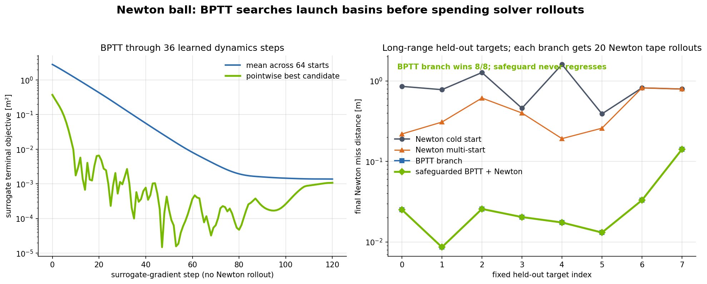
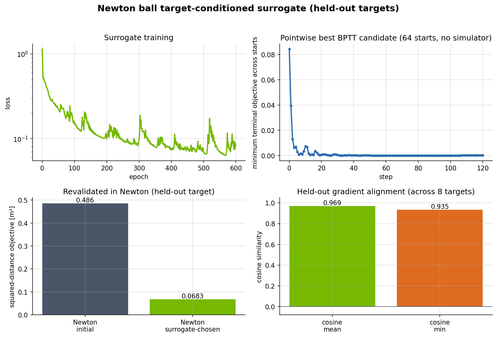
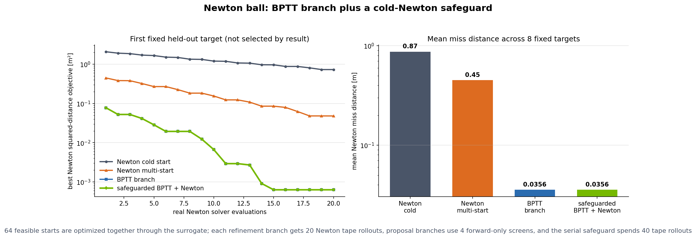
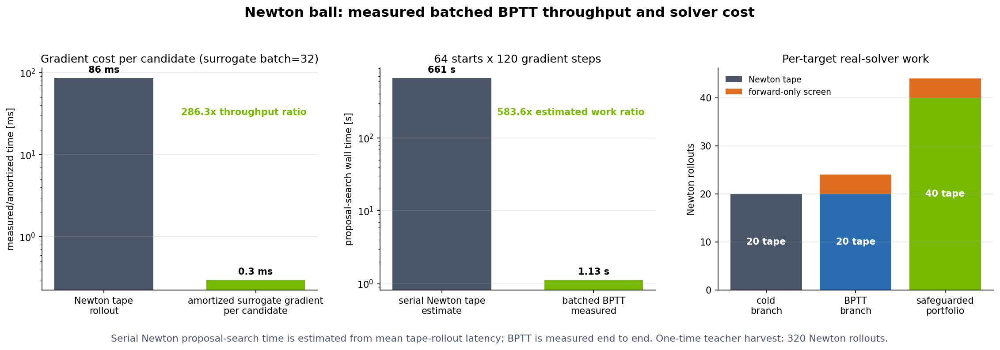
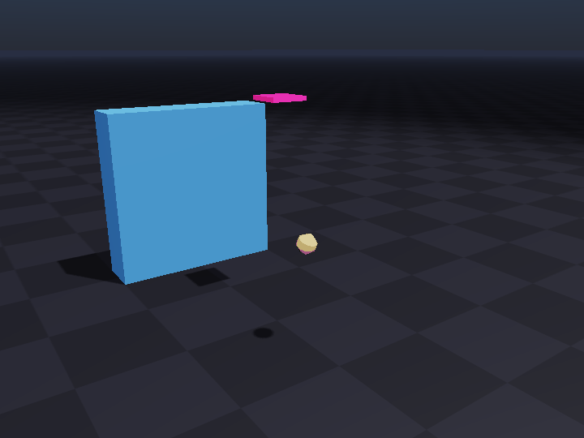

<!-- markdownlint-disable MD003 MD022 MD032 MD033 MD049 -->
# BPTT surrogate design with a differentiable Newton ball

PhysicsNeMo gives you reusable tools for physics-design optimization, including
backpropagation through time (BPTT) over a learned dynamics model. This example
is a worked demonstration of that on the **Newton + PhysicsNeMo integration**,
and shows how BPTT can provide proposal starts for a Newton design loop. The same
APIs can be adapted to a differentiable Newton scene that exposes an observation,
design field, conditioning inputs, and scalar objective.

## The problem

A ball must reach a requested terminal position after interacting with the
ground and wall. The only thing we get to choose is the initial launch velocity,
and the contacts make the relationship between launch and endpoint tricky. A
naive launch from a cold start can easily end up in the wrong region entirely.

Newton supplies reference trajectories and Warp-autodiff derivatives of the
implemented discrete rollout. PhysicsNeMo trains a target-conditioned dynamics
surrogate, unrolls it through the complete flight, and backpropagates the
terminal miss through every learned time step back to the launch velocity.

The trained surrogate can optimize many launch basins together as one Torch batch
before spending another Newton rollout. The benchmark compares those proposals
with cold-start and solver-only multistart baselines at equal refinement depth.
A safeguarded portfolio retains the cold branch, so its returned full-Newton
result cannot regress when a learned proposal is unhelpful.



## The physics and design problem

The state at frame $t$ is the ball position and velocity:

$$
s_t = [p_t, v_t] \in \mathbb{R}^{6}.
$$

The design variable is the initial launch velocity:

$$
u = v_0 \in \mathbb{R}^{3}.
$$

For a requested target $g \in \mathbb{R}^{3}$, the objective is the squared
terminal miss after $H=36$ frames:

$$
\mathcal{L}(u, g) = \lVert p_H(u) - g \rVert_2^2.
$$

The wall and contact make the global design landscape difficult from some initial
launches. Newton can differentiate its real solver and locally refine a launch
very effectively, but a fixed solver budget may not be enough to move a cold
start into the right launch basin.

Every target used for training or evaluation is reachable by construction: it is
the real Newton endpoint of another feasible launch. The evaluation targets use a
seed independent of training and validation.

## What BPTT does

The surrogate is a residual dynamics model conditioned on the requested target:

$$
\hat{s}_{t+1} = \hat{s}_t + f_\theta(\hat{s}_t, g).
$$

It is unrolled for the full flight:

$$
\hat{s}_0 \rightarrow \hat{s}_1 \rightarrow \cdots \rightarrow \hat{s}_H,
\qquad
\hat{\mathcal{L}}(u,g)=\lVert \hat{p}_H-g\rVert_2^2.
$$

BPTT differentiates the terminal objective through every learned step:

$$
\begin{aligned}
\frac{\partial \hat{\mathcal{L}}}{\partial u}
&=
\frac{\partial \hat{\mathcal{L}}}{\partial \hat{s}_H}
\left(
\prod_{t=0}^{H-1}
\frac{\partial \hat{s}_{t+1}}{\partial \hat{s}_t}
\right)
\frac{\partial \hat{s}_0}{\partial u}.
\end{aligned}
$$

That gradient is inexpensive because the unrolled model is a normal
PhysicsNeMo/PyTorch module. `BPTTSurrogate.optimize_multistart(...)` therefore
optimizes 64 diverse launch starts together in one batch, using no Newton solver
rollout inside the proposal search.

Newton still defines the benchmark objective. The surrogate is trained from
Newton trajectories and adjoints, and every reported launch is scored by a full
Newton simulation.

## Training signal

For each teacher sample, the example:

1. Draws a feasible launch $u$ and an independent reachable target $g$.
2. Runs `differentiable_rollout(...)` through Newton.
3. Records the full trajectory and Newton's adjoint
   $\partial\mathcal{L}/\partial u$.
4. Trains the surrogate to match both the state rollout and the design gradient.

Conceptually, the training loss is:

$$
\begin{aligned}
\mathcal{L}_{train}
&=
\mathcal{L}_{state}
+ \lambda_{task}\mathcal{L}_{task}
+ \lambda_{grad}\mathcal{L}_{gradient\ alignment}.
\end{aligned}
$$

Gradient alignment matters here. The surrogate is not only asked to predict a
plausible trajectory, it must also provide a useful BPTT direction for optimizing
the launch.

The main example writes a scorecard containing surrogate training, multi-start
BPTT descent, real Newton revalidation, and held-out gradient alignment:



The scorecard plots the pointwise best surrogate objective across all starts; the
winning candidate can change between optimizer steps. It separately reports the
selected winner's initial and best objectives. Newton revalidation uses the
squared-distance objective in $\mathrm{m}^2$, while benchmark miss values below
are Euclidean distances in meters. In the full scorecard shown above, the
selected winner's surrogate objective improves from 0.4931 to
$1.497\times10^{-5}$, its Newton objective improves from 0.4863 to 0.06826
$\mathrm{m}^2$, and the mean held-out gradient cosine is 0.9685.

## Safeguarded BPTT benchmark

The benchmark constructs the complete set of eight fixed long-range held-out
targets before invoking any optimizer. "Long-range" is defined geometrically:
the target must be at least 1 m from the nominal launch endpoint. Selection uses
only an independent random seed and this distance threshold, never optimizer
results. The first fixed target is used for detailed curves.

Each branch receives the same number of differentiable Newton refinement
rollouts. Proposal branches additionally use four cheaper forward-only Newton
rollouts to screen candidate launches:

| Method | Proposal and refinement strategy |
| --- | --- |
| Newton cold start | Refine the nominal launch for the full solver budget. |
| Newton multi-start | Screen the nominal launch plus three unoptimized feasible Sobol starts, then refine the best full-Newton candidate. |
| BPTT branch | Optimize 64 feasible Sobol starts through the surrogate, screen the best four in Newton, then refine the best full-Newton candidate. |
| Safeguarded BPTT + Newton | Return the better full-Newton result from the cold and BPTT branches. |

The Newton multi-start and BPTT branches begin from the same quasi-random samples
of the example's clipped feasible launch distribution and use the same screening
count and refinement depth. BPTT additionally uses a surrogate trained from 320
one-time Newton rollouts, then optimizes and ranks all 64 starts before Newton is
called. The safeguarded result cannot be worse than cold Newton by construction:
`optimize_field_in_newton_multistart(...)` fully refines
`[cold_start, bptt_proposal]` and returns the lower full-Newton objective. Serial
execution spends both branches and reports that cost.



The generated benchmark report records how often the BPTT branch itself wins,
along with the guaranteed non-regression of the safeguarded result.

With the default full run:

| Method | Mean Newton miss distance [m] | Result |
| --- | ---: | ---: |
| Newton cold start | 0.870 | reference |
| Newton multi-start | 0.450 | solver-only proposal baseline |
| BPTT branch | **0.0356** | **8/8** |
| Safeguarded BPTT + Newton | **0.0356** | **8/8, never worse by construction** |

Every refinement branch receives 20 differentiable Newton rollouts. Each
proposal branch additionally spends four forward-only screens. The safeguard
spends 40 tape rollouts plus the BPTT branch's four screens when its independent
cold and BPTT branches run serially. Target construction and the one-time teacher
harvest are reported separately.

### Speed and solver cost

The speed figure reports timing from the same benchmark run:

+ Mean latency of one differentiable Newton tape rollout versus amortized
  per-candidate surrogate-gradient time from one batched validation evaluation.
+ The measured batched BPTT proposal-search time for 64 starts and 120 gradient
  steps versus a serial Newton-tape work estimate for the same number of
  start-step pairs.
+ The real-solver work for one cold branch, one BPTT branch, and the safeguarded
  two-branch portfolio.

The first ratio is a batched throughput comparison, not isolated single-candidate
latency. The serial Newton value is a counterfactual work estimate based on mean
tape-rollout latency, not a timed Newton optimizer with equivalent convergence.
The BPTT proposal-search time is measured end to end. Regenerate these
hardware-dependent values before comparing systems:

| Measurement | Value |
| --- | ---: |
| Newton tape rollout | 86.0 ms |
| Amortized surrogate gradient per candidate (batch 32) | 0.3005 ms |
| Amortized gradient-throughput ratio | **286.3x** |
| Batched BPTT proposal search, 64 starts x 120 steps | 1.132 s |
| Estimated serial Newton tape search for the same start-step pairs | 660.7 s |
| Estimated serial-work / measured-BPTT ratio | **583.6x** |



The benchmark was recorded on June 8, 2026 using an NVIDIA RTX PRO
6000 Blackwell Server Edition MIG 1g.24gb partition, Newton 1.2.1, Warp 1.13.0,
PyTorch 2.12.0 with CUDA 13.0, and Python 3.14. The one-time teacher harvest used
320 Newton rollouts; target setup used one nominal-endpoint rollout and ten
reachable-target rollouts. Both Newton and Torch ran on CUDA.

This is the useful division of labor:

+ BPTT performs broad, batched, inexpensive search through a learned long-horizon
  model.
+ Newton screens and polishes the small number of proposals using its full solver.
+ The safeguard preserves the cold-Newton result whenever a surrogate proposal is
  unhelpful.
+ The branch comparison holds screening and refinement depth fixed after
  training. It does not include the one-time teacher-data cost in each target.

## PhysicsNeMo integration

The file declares only the problem-specific pieces: the ball observation, target
loss, launch distribution, and target inputs. PhysicsNeMo provides the
reusable integration:

+ `NewtonEnv` for headless reset, step, and rollout lifecycle.
+ `field_to_torch(...)` for zero-copy Warp-to-Torch state access when no
  conversion or clone is requested.
+ `differentiable_rollout(...)` for Newton trajectories and solver adjoints.
+ `collect_teacher_batch(...)` for teacher-data collection.
+ `BPTTSurrogate` for gradient-matched training and full-horizon optimization.
+ `BPTTSurrogate.optimize_multistart(...)` for batched BPTT proposal search.
+ `optimize_field_in_newton(...)` for full-Newton adjoint refinement.
+ `optimize_field_in_newton_multistart(...)` for safeguarded proposal portfolios.

For another Newton scene, callers must supply scene-specific observation,
design-field reset, conditioning, feasibility, and objective definitions.

## Run the example

Install the PhysicsNeMo `newton` extra, then run from the repository root. The
`--newton-device cuda --torch-device cuda` flags below require a GPU; on a
CPU-only machine omit them (these scripts default to `cpu`).

```bash
uv run python \
    examples/newton/diffsim/example_diffsim_ball_surrogate_bptt.py \
    --newton-device cuda --torch-device cuda
```

Run the safeguarded BPTT benchmark and generate the three result figures:

```bash
uv run python \
    examples/newton/diffsim/analyze_diffsim_optimizers.py \
    --newton-device cuda --torch-device cuda
```

Render the real Newton rollout GIF:

```bash
uv run python \
    examples/newton/diffsim/render_diffsim_rollout.py \
    --newton-device cuda --torch-device cuda
```

A small smoke run is useful for checking the installation, but it is not expected
to reproduce the trained BPTT results:

```bash
uv run python \
    examples/newton/diffsim/analyze_diffsim_optimizers.py \
    --samples 8 --val-samples 4 --epochs 20 --steps 8 \
    --hidden-dim 32 --depth 2 --benchmark-targets 2 \
    --surrogate-starts 4 --surrogate-steps 20 --screened-candidates 2 \
    --refine-steps 3 --min-nominal-miss 0.3 \
    --newton-device cuda --torch-device cuda
```

Outputs are written to `examples/newton/diffsim/outputs/diffsim/`. Use
`--output-dir` to choose another location.

## Real Newton rollout

The animation renders the Newton simulation, not the surrogate rollout. The
target was not used for training. BPTT proposes a launch; Newton independently
refines both the cold and proposed starts, selects the better objective, and
executes that launch. The magenta plate visualizes the terminal center-position
objective; it is a marker, not an additional collision shape.



## References

+ [Newton](https://github.com/newton-physics/newton), the GPU-accelerated physics
  engine built on Warp
+ [PhysicsNeMo Newton integration API](https://docs.nvidia.com/physicsnemo/latest/physicsnemo/api/physicsnemo.experimental.integrations.newton.html)
+ [Warp](https://github.com/NVIDIA/warp), Newton's differentiable kernel
  framework
