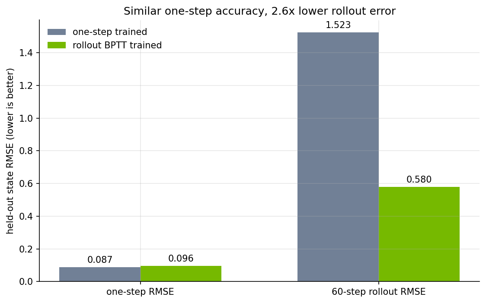

<!-- markdownlint-disable MD003 MD022 MD032 MD033 MD049 -->
# Rollout BPTT for learned cart-pole dynamics

Part of the [Newton + PhysicsNeMo examples](../README.md); start there if
Newton or PhysicsNeMo is new to you.

This example isolates one training question: can a learned dynamics model
remain accurate when it must consume its own predictions? BPTT
(backpropagation through time) here means the free-running rollout loss is
backpropagated through the model's own predicted states.

Newton generates force-driven cart-pole trajectories. Two identical
`ResidualDynamics` models start from the same weights and see the same data:

| Model | Training signal |
| --- | --- |
| One-step baseline | Predict the next state from the true current state. |
| Rollout BPTT | Add a free-running loss that feeds every prediction into the next learned step. |

There is no control objective, solver adjoint, or policy optimization in this
example. It compares surrogate training methods directly.

## Why the rollout term is BPTT

Let the learned step be

$$
\hat{s}_{t+1}=F_\theta(\hat{s}_t,u_t).
$$

Teacher-forced training minimizes

$$
\mathcal{L}_{1}
=
\frac{1}{H}\sum_{t=0}^{H-1}
\ell\left(F_\theta(s_t,u_t),s_{t+1}\right).
$$

Each prediction starts from a true Newton state, so the model does not train on
the states produced by its own errors.

Rollout training instead starts from only the first true state:

$$
\hat{s}_0=s_0,\qquad
\hat{s}_{t+1}=F_\theta(\hat{s}_t,u_t),
$$

and minimizes

$$
\mathcal{L}_{roll}
=
\frac{1}{H}\sum_{t=1}^{H}\ell(\hat{s}_t,s_t).
$$

Later errors backpropagate through every earlier learned step. The implemented
objective is

$$
\mathcal{L}_{train}
=
\mathcal{L}_{1}
+\lambda(e)\mathcal{L}_{roll},
$$

where $\lambda(e)$ ramps up during early epochs.

## Experiment

The state is

$$
s_t=[x_t,\theta_t,\dot{x}_t,\dot{\theta}_t],
$$

and $u_t$ is the horizontal force applied to the cart. Training and held-out
trajectories use independently sampled initial states and bounded random force
sequences. Both models use the same architecture, initialization, optimizer,
and one-step loss.

The comparison reports:

+ one-step RMSE from true states;
+ free-running RMSE over all 60 predicted steps; and
+ terminal RMSE at step 60.

The default run produces:

| Metric | One-step only | One-step + BPTT |
| --- | ---: | ---: |
| Held-out one-step RMSE | 0.0871 | 0.0964 |
| Held-out rollout RMSE | 1.5235 | **0.5798** |
| Held-out terminal RMSE | 2.4635 | **0.7630** |



The single chart is the whole message: similar local accuracy does not guarantee
an accurate free-running model. Rollout BPTT lowers the held-out rollout error
by 2.6x because it directly trains against that failure mode.

## PhysicsNeMo support

The example uses:

+ `NewtonEnv` to generate replicated Newton trajectories;
+ `TeacherBatch` to store states and force sequences;
+ `ResidualDynamics` as the learned one-step model;
+ `BPTTSurrogate.fit(...)` for one-step plus rollout-BPTT training; and
+ `BPTTSurrogate.evaluate(...)` for local, rollout, and terminal errors.

## Run

From the repository root:

```bash
uv run python examples/newton/diffsim/example_diffsim_cartpole_bptt.py
```

The script writes `cartpole_bptt_report.md` and
`diffsim_cartpole_bptt_error.png` under
`examples/newton/diffsim/outputs/diffsim/` by default.

## References

+ [Newton](https://github.com/newton-physics/newton)
+ [PhysicsNeMo Newton integration API](https://docs.nvidia.com/physicsnemo/latest/physicsnemo/api/physicsnemo.experimental.integrations.newton.html)
+ [Warp](https://github.com/NVIDIA/warp)
