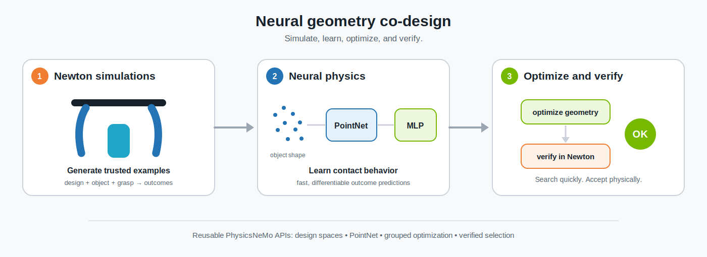
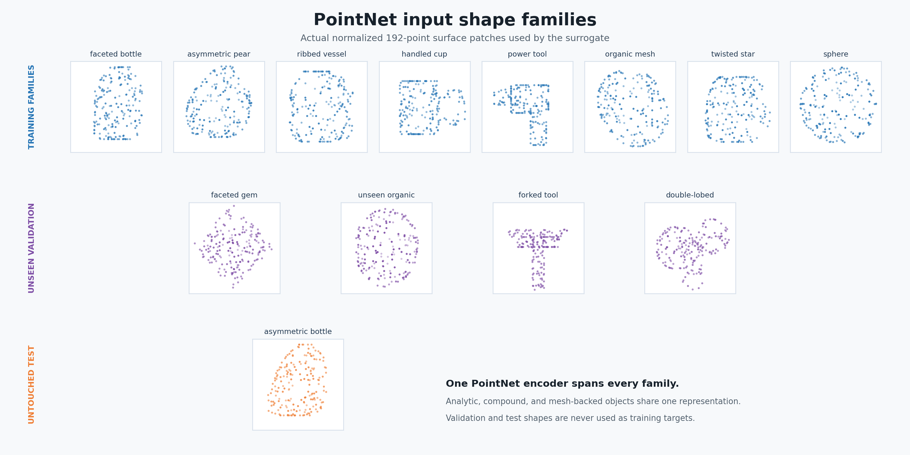
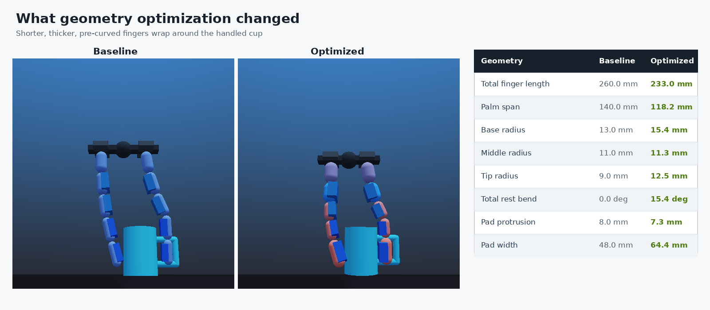

<!-- markdownlint-disable MD033 MD043 -->
# Neural geometry co-design with PhysicsNeMo and Newton

PhysicsNeMo gives you the building blocks to take a physics simulator and turn
it into an engineering optimizer: sample a design space, run the simulator in
large batches, train a fast differentiable surrogate on the results, optimize a
design through that surrogate, and then verify the winner back in the simulator.

This example puts those pieces together on a concrete problem: redesigning the
geometry of a robot gripper so it holds many different objects more reliably.
It is meant to be read as a worked example of the **Newton + PhysicsNeMo
integration**, not as a finished gripper product. The point is to show *why*
PhysicsNeMo is useful. The same workflow applies to any expensive simulator you
want to optimize against.

> **In short:** brute-forcing this design search directly in the physics
> simulator would take an estimated 8 hours. The PhysicsNeMo workflow finds a
> *better* design, verified by the same simulator, in about 15 minutes, and the
> design, optimization, and verification code is reusable across problems.

## The problem

A parallel-jaw gripper has two fingers that close on an object and lift it. How
well it grasps depends on its geometry: how long the finger segments are, how
thick they are, how much they curve, how wide the contact pads are, and so on.

We want **one** gripper geometry that works well across a whole library of
objects (bottles, cups, tools, irregular blobs), not a different gripper per
object. This is a *co-design* problem: we are searching the space of physical
designs for the single design that performs best on average across many tasks.

Why is this hard?

- **Each evaluation is expensive.** Scoring one geometry means simulating it
  closing on every object, from several grasp poses, in a contact-rich physics
  engine. A thorough search needs thousands of these simulations.
- **The simulator is not directly optimizable.** You cannot just run gradient
  descent on the physics engine to nudge the geometry toward a better grasp.

PhysicsNeMo's answer is to **learn a fast, differentiable stand-in (a
surrogate) for the simulator**, optimize against that, and then let the
simulator have the final say.

## How the workflow solves it

The full run has four stages. Newton (the physics simulator) is the source of
truth at the start and at the end, while the neural model does the fast
searching in the middle.

1. **Sample** a batch of candidate geometries from a bounded design space.
2. **Simulate** every geometry on every training object and grasp pose in
   batched Newton worlds. This is the expensive, one-time evidence collection.
3. **Train** a neural physics model on those simulated outcomes so it can
   predict grasp performance for *new* geometries almost instantly.
4. **Optimize and verify**: run gradient-based search through the differentiable
   surrogate to propose strong designs, then replay the shortlisted finalists in
   Newton and accept one only if it truly beats the best simulated design we
   already had.



That last step is what makes the result trustworthy as the surrogate can be
optimistic, so a design is only accepted after Newton confirms it.

The example is built so the gripper itself is the only application-specific
part. The reusable machinery (design spaces, geometry adapters, point-cloud
models, grouped optimization, shortlisting, and verified selection) comes from
PhysicsNeMo APIs you can reuse on your own problems.

## What the example optimizes

The gripper geometry is described by **19 variables**:

- five shared segment lengths
- five shared segment radii
- five shared rest angles (the manufactured curvature)
- finger length scale
- palm radius
- contact-pad protrusion and width

Material, friction, actuation, and solver parameters stay fixed, so the
comparison isolates geometry. The two opposing jaws share one profile, so they
stay mirrored by construction.

For each object the optimizer can also pick the best of **12 candidate grasp
poses**. The objective rewards a good, robust grasp and lightly penalizes
needlessly complex geometry. It combines:

- retained lift after closing and lifting
- lateral slip under a 1.6 N disturbance
- object rotation
- grasp success
- a small geometry-simplicity regularizer

So the problem is: find one shared geometry `d`, while choosing the best pose
per object, that minimizes the robust aggregate loss across all objects:

```text
minimize over geometry d
    robust aggregate over objects(
        min over candidate poses  loss(d, object, pose)
    )
    + simplicity(d)
```

## The object library

Training deliberately mixes clean analytic shapes with messy, irregular meshes,
so the model has to generalize rather than memorize:

- a faceted bottle
- an asymmetric pear
- a ribbed vessel
- a handled cup
- an offset power tool
- an organic lobed mesh
- a twisted star-shaped mesh
- a sphere as a smooth reference case

Four **unseen** geometry families are reserved for validating finalists: a
faceted gem, another organic mesh, a forked household tool, and a double-lobed
container. An asymmetric bottle with a different profile is held back entirely
as an untouched test object.



These are the normalized, candidate-local surface patches handed to PointNet.
The same 192-point representation covers analytic primitives, compound objects,
and irregular PhysicsNeMo meshes, with no separate parameterization per shape
family.

`NewtonRigidObject` gives every object a single definition for collision
geometry, an additive mass estimate, bounds, fingerprints, and surface
sampling. Primitive and closed-mesh part volumes are summed, so overlaps in a
compound object are counted more than once. It supports analytic primitives,
compound objects, PhysicsNeMo meshes, and mixtures of these:

```python
from physicsnemo.experimental.integrations.newton import (
    NewtonPrimitive,
    NewtonRigidObject,
)

handled_object = NewtonRigidObject(
    name="handled_object",
    density=320.0,
    parts=(
        NewtonPrimitive("cylinder", (0.037, 0.050)),
        NewtonPrimitive("capsule", (0.007, 0.024), position=(0.055, 0.0, 0.026)),
        NewtonPrimitive("capsule", (0.007, 0.024), position=(0.055, 0.0, -0.026)),
    ),
)
```

Mesh-backed objects use the same interface:

```python
from physicsnemo.experimental.integrations.newton import NewtonRigidObject
from physicsnemo.mesh.primitives.procedural import lumpy_sphere

mesh_object = NewtonRigidObject.from_mesh(
    name="irregular_object",
    mesh=lumpy_sphere.load(
        radius=0.05,
        subdivisions=2,
        noise_amplitude=0.15,
        seed=7,
    ),
    density=380.0,
)
```

## The neural physics model

The surrogate predicts Newton grasp outcomes from three inputs:

```text
candidate-local object surface points
        -> PointNet shape code

normalized gripper geometry d
candidate pose p
mass, scale, and position context
        -> global features

[shape code, global features]
        -> five-layer MLP
        -> lift, slip, rotation, success, objective
```

Crucially, PointNet encodes the **grasped object**, not the gripper. Each object
surface is oversampled, transformed into the candidate gripper frame, cropped to
the gripper's interaction envelope, and resampled to 192 points. A shared
point-wise MLP processes each point independently, then symmetric max pooling
collapses them into one fixed-width shape code, so reordering the points does
not change the encoding.

The 19 gripper variables skip PointNet and are concatenated with the shape code,
pose, mass, scale, and position features before the outcome MLP. During
co-design the object and pose condition the predicted physics, while gradients
update only the shared gripper geometry.

This is what lets a single model consume bottles, handled compounds, irregular
meshes, and even sensor-derived point clouds without inventing a new parameter
vector per object family. If your application has a single known parametric
shape instead, you can swap `PointNetMLP` for a smaller conditioned MLP. The
optimization and verification APIs do not care which encoder you use.

```python
from physicsnemo.models.pointnet import PointNetMLP

model = PointNetMLP(
    point_channels=3,
    global_features=geometry_dim + context_dim,
    point_features=64,
    hidden_features=128,
    hidden_layers=5,
    out_features=5,
)
```

The widths above are deliberately reduced for illustration; the shipped run
defaults to `point_features=128` and `hidden_features=256`
(`--point-features` / `--hidden-features` in `example_gripper_design.py`).

## The simulated evidence table

Stage 2 produces the dataset the surrogate learns from:

```text
96 sampled geometries
  x 8 training objects
  x 12 candidate poses
= 9,216 Newton worlds
```

During model selection, **complete gripper designs** are held out rather than
random rows. This is a stricter test: it checks whether the surrogate can rank
poses and geometries it never saw during training, which is exactly what it must
do during the search.

## Grouped optimization and candidate selection

The surrogate evaluates losses with shape
`(optimization starts, objects, candidate poses)`. Early in the search the
optimizer keeps several promising poses per object. Later it narrows each group
down to its single best pose:

```python
result = optimize_grouped_design(
    grouped_losses,
    design_space=space,
    starts=measured_start_designs,
    steps=260,
    lr=0.015,
    top_k_schedule=((0.0, 5), (0.62, 3), (0.84, 1)),
    trust_radius=0.02,
    regularizer=geometry_regularizer,
)
```

A small trust region keeps gradient updates close to geometries the simulator
actually evaluated, where the learned model has direct evidence and is least
likely to be fooled.

Snapshots are collected throughout the trajectory, not just at the final step.
`select_diverse_designs` then prunes near-duplicates before the expensive
verification stage:

```python
candidates, steps, trajectories = result.trajectory_candidates(snapshots=20)
candidates = select_diverse_designs(
    candidates,
    surrogate_scores,
    count=48,
    min_distance=0.020,
    group_ids=trajectory_ids,
    min_per_group=1,
    required_indices=trajectory_anchors,
)
```

Anchors preserve one local proposal from every optimizer start. Group coverage
keeps at least one more candidate per trajectory, and the rest of the
verification budget is ranked globally.

For each finalist, the surrogate shortlists eight poses per object, and Newton
replays those poses on all training and validation objects.
`select_verified_design` accepts the neural proposal **only when its measured
objective beats the best sampled incumbent**. Final ranking combines mean
performance with the worst third of tasks, and a hard validation gate rejects
any geometry that fails an unseen shape family.

## Reusable PhysicsNeMo APIs

These are the general-purpose pieces this example is built on. Reuse them for
your own simulator-trained design problems:

| API | Purpose |
| --- | --- |
| `DesignVariable`, `DesignSpace` | Bounded continuous and integer design schemas |
| `DesignRegularizer` | Composable simplicity, smoothness, and similarity terms |
| `NewtonPrimitive`, `NewtonMesh`, `NewtonRigidObject` | Shared neural and Newton geometry |
| `Mesh.sample_random_points` | Area- or volume-weighted mesh sampling |
| `PointNetEncoder`, `PointNetMLP` | Model-zoo point-set models |
| `grouped_candidate_ranking_loss` | Supervision for grouped pose or action ranking |
| `optimize_grouped_design` | Differentiable shared-design optimization |
| `shortlist_grouped_candidates` | Neural filtering before expensive evaluation |
| `select_diverse_designs` | Geometry-aware proposal thinning |
| `select_verified_design` | Simulator-authoritative proposal acceptance |

The example-specific files are separated by responsibility:

| File | Responsibility |
| --- | --- |
| `gripper_scene.py` | Geometry, Newton scene, poses, and measurements |
| `gripper_model.py` | PointNet-conditioned outcome model and training |
| `gripper_workflow.py` | Dataset, optimization, verification, and reporting |
| `example_gripper_design.py` | Command-line entry point |
| `render_gripper.py` | Comparison animation, shape-family figure, and detailed design figure |

## The verified result


The animation shows the optimized geometry closing around several object
families more reliably than the straight baseline.



The handled-cup close-up and parameter table make the change visible: the
optimized fingers are shorter, thicker, and pre-curved, with wider contact pads.

The recorded run with seed 31 produced:

| Metric | Result |
| --- | ---: |
| Newton training worlds | 9,216 |
| Newton evidence generation | 437.2 s |
| Train and select three surrogate restarts | 170.8 s |
| Gradient co-design search | 5.02 s |
| Newton finalist and test verification | 273.5 s |
| Complete pipeline | 887.0 s (14.8 min) |
| Estimated direct Newton replay of the gradient search | 7.9 h |
| Estimated direct-replay / complete-pipeline ratio | 32.2x |
| Surface-masked / PointNet design ranking | 55.4% / 80.8% |
| Best sampled / verified neural objective | 0.0507 / **0.0385** |
| Improvement over the measured incumbent | **24.0%** |
| Baseline / selected-design retained grasps | 10/13 / **13/13** |

All eight training objects, four unseen validation families, and the untouched
test bottle pass Newton verification. The selected design changes all 19
coordinates relative to the best sampled incumbent, including its segment
profiles, manufactured curvature, palm span, and contact pads.

Exact run metrics, the selected physical geometry, and per-object Newton
outcomes are written to:

```text
outputs/gripper/gripper_design_report.md
outputs/gripper/gripper_design_data.npz
```

The reported Newton-replay time is a throughput estimate derived from the
measured dataset generation rate, not a separately timed brute-force run.

## Run it

Install the Newton extra in the PhysicsNeMo checkout, then run from the
repository root:

```bash
uv sync --extra newton

uv run python \
  examples/newton/gripper/example_gripper_design.py
```

The simulation dataset is cached. Regenerate it after changing object geometry,
poses, actuation, solver settings, or the design schema:

```bash
uv run python \
  examples/newton/gripper/example_gripper_design.py \
  --regenerate-dataset
```

Render the comparison animation, shape-family figure, and detailed design
figure (the workflow diagram above ships as a static figure and is not
regenerated):

```bash
uv run python \
  examples/newton/gripper/render_gripper.py
```

## Adapt it to your own problem

The gripper is just the demo. To build a different simulator-trained design
application, follow the same six steps:

1. Define your physical variables with `DesignSpace`.
2. Implement an authoritative batched evaluator (your simulator).
3. Represent task geometry with a model-zoo encoder.
4. Return surrogate losses grouped by task and candidate.
5. Optimize with `optimize_grouped_design`.
6. Shortlist and verify proposals with the authoritative evaluator.

The evaluator does not have to be a gripper, or even use Newton. The design,
grouped-optimization, and candidate-selection APIs are simulator-independent,
and the Newton package simply provides one ready-made integration.

## Reference

The simulator-trained neural co-design structure is inspired by Yi et al.,
[Co-Design of Soft Gripper with Neural Physics](https://arxiv.org/abs/2505.20404),
Conference on Robot Learning, 2025.
