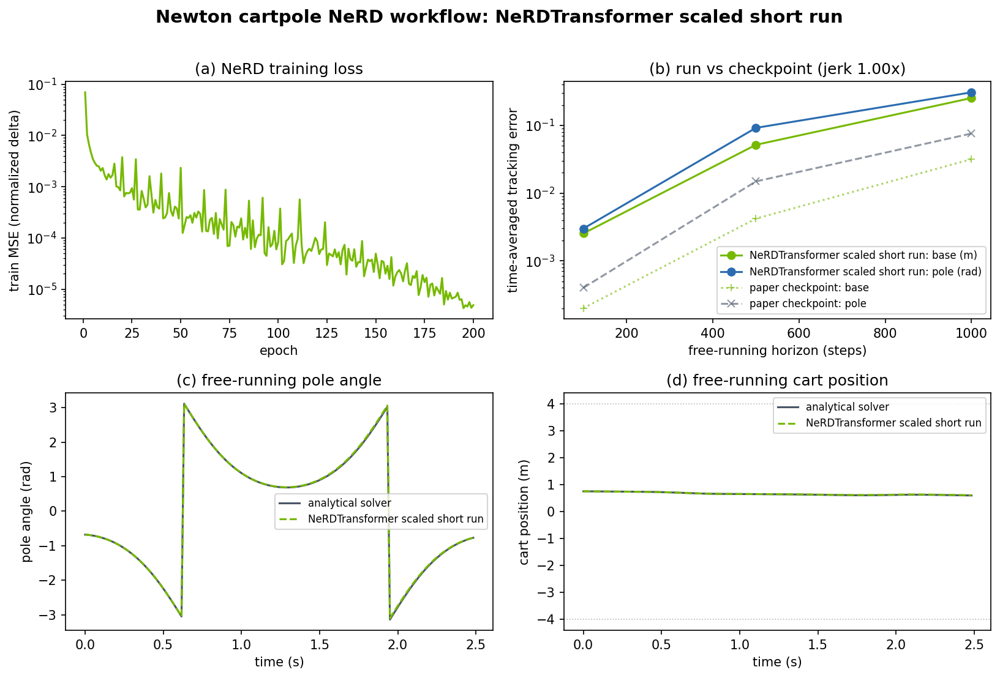
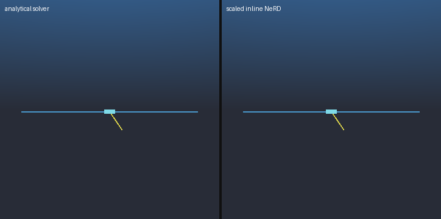
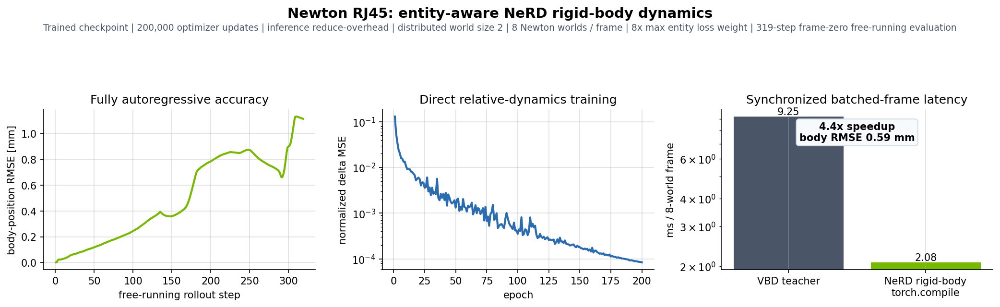

<!-- markdownlint-disable MD033 -->
# Neural Robot Dynamics for Newton

Part of the [Newton + PhysicsNeMo examples](../README.md); start there if
Newton or PhysicsNeMo is new to you.

PhysicsNeMo gives you the reusable tools to train a neural network that replaces
a physics solver, then deploy that learned model back into the simulator. These
examples are a worked demonstration of that on top of the **Newton + PhysicsNeMo
integration**, using [Neural Robot Dynamics](https://neural-robot-dynamics.github.io/) (NeRD).

The same workflow learns a single Newton simulation step and then runs that
learned model on its own, frame after frame, in place of the analytical
solver -- a reusable pattern you can apply to your own physics.

Two deliberately different problems show the same workflow applied to very
different physics:

| Example | Newton state learned by NeRD | Teacher |
| --- | --- | --- |
| `example_cartpole_nerd.py` | Generalized joint coordinates and velocities | Featherstone articulation solver |
| `example_rj45_nerd.py` | One pose and spatial velocity token per rigid body | Contact-rich VBD cable simulation |

Both share the same public PhysicsNeMo workflow, so you can change the state
representation, inputs, model, and physical evaluation metric without ever
writing a new trainer or deployment API.

## What NeRD learns

Instead of learning an entire trajectory,
NeRD learns to reproduce a *single* simulation step. Newton's solver advances the
world by one frame, and NeRD learns to imitate that one transition. Once it can
do that reliably, you can call it over and over, feeding each prediction back in
as the next input, and let it generate a full rollout on its own, with no
analytical solver in the loop.

Concretely, let `s[t]` be the physical state at frame `t`, `c[t]` any input your
application defines (forces, target poses, commands, and so on), and `h` the
causal history length. Rather than predicting the next state outright, NeRD
predicts a *relative* physical update and integrates it onto the current state:

```text
delta_state[t] = model(encode(state[t-h+1:t]), input[t-h+1:t])
state[t+1] = integrate(state[t], delta_state[t])
```

Training scores every position in each causal window. Those positions supervise
the same history lengths from one frame through `h` that deployment encounters
while its history fills after reset.

A few things are worth unpacking here:

- **It predicts changes, not absolute states.** Learning the small
  frame-to-frame *delta* is far easier and more numerically stable than
  regressing the next state directly, and it keeps predictions close to the
  physically valid manifold. This residual formulation is central to the NeRD
  paper.
- **It looks at a short window of history.** The model conditions on the last
  `h` frames (`state[t-h+1:t]`) rather than just the current frame. This causal
  window lets it capture effects that a single snapshot cannot, such as contact
  and velocity history, which matters most in the contact-rich RJ45 example.
- **The state codec speaks each quantity's native geometry.** `encode`, the
  relative update, and `integrate` are all defined by the codec so that updates
  stay physically meaningful. For example, joint angles wrap at `2 * pi`, while
  rigid-body orientation changes are expressed as rotation-vector deltas and
  re-integrated through normalized quaternions, rather than naively subtracting
  raw values.
- **Inputs and targets are normalized.** PhysicsNeMo computes global mean/std
  statistics over the collected trajectories and trains the model on normalized
  relative dynamics, so no single channel dominates the loss.

The real test is not one-step accuracy, it is the **free-running rollout**.
During evaluation, each prediction becomes the next input to the model, with no
teacher correction. This is the hard, deployment-relevant regime: a tiny per-step
error can compound into large long-horizon drift, so the scorecards in this
folder report error accumulated over hundreds of autoregressive frames rather
than a single step.

Throughout, Newton stays the source of teacher trajectories and held-out
validation, and PhysicsNeMo handles the rest: the learned models, distributed
training, normalization, causal windows, evaluation utilities, checkpoints, and
live learned-step deployment.

For the full mathematical formulation, the training methodology, and the
benchmark results this workflow is based on, see the NeRD paper
([Xu et al., CoRL 2025](https://neural-robot-dynamics.github.io/)).

## One workflow for a new Newton problem

The reusable API has just four pieces:

| Piece | Responsibility |
| --- | --- |
| `NeRDStateCodec` | Read/write Newton state and encode physically valid relative updates (advanced: you only touch this for custom state) |
| `NeRDProblem` | Reset and advance one application-specific Newton run |
| `fit_nerd` | Collect or consume trajectories, normalize them, and train (advanced: `train_nerd` is the lower-level entry point) |
| `TrainedNeRDModel` | Evaluate, save/load, predict, and create a `NewtonStepModel` |

For a standard Newton scene, a new problem needs only a small amount of code:

```python
import numpy as np
import torch

from physicsnemo.experimental.integrations.newton import (
    NeRDControlInput,
    NeRDProblem,
    fit_nerd,
)


# This example's Newton control has two generalized forces per world.
control_input = NeRDControlInput("joint_f", per_world_shape=(2,))


def randomize(env, rng: np.random.Generator):
    # Randomize the initial Newton state for this application's operating range.
    ...


def sample_inputs(rng, world_count, frame):
    # Any model input owned by the application. This may instead return
    # [world_count, entity_count, features] for per-body/per-particle inputs.
    return torch.zeros(world_count, 2)


problem = NeRDProblem.from_env(
    env,
    state_codec="joint",
    randomize=randomize,
    sample_inputs=sample_inputs,
    apply_inputs=control_input.apply,
)
trained = fit_nerd(
    problem,
    num_trajectories=10_000,
    steps=100,
    dynamics_model="NeRDTransformer",
)
learned_step = trained.as_step_model(
    newton_model=env.model,
    input_from_step=control_input.from_step,
)
```

The inputs are intentionally defined by your example, not by NeRD itself. They
might be joint forces, target poses, material properties, external loads, contact
flags, commands, or a zero-width tensor for fully autonomous dynamics:

- Global inputs use shape `[worlds, features]`.
- Entity-aligned inputs use shape `[worlds, entities, features]`.
- `NeRDControlInput` provides matched collection/deployment callbacks for a
  named Newton control field, including namespaced fields such as
  `mujoco.ctrl`.
- `NeRDRigidContactInput` converts Newton's variable-length rigid-contact
  buffers into fixed per-body contact counts, mean normals, and mean body-frame
  contact points. Use `concatenate_nerd_inputs` to combine those entity features
  with global commands.
- `NeRDProblem.observe_inputs` separates controls that advance the teacher from
  state-derived features stored for the model. During collection,
  `NeRDRigidContactInput.read_env` refreshes and reads contacts from the current
  Newton state.
- Other `input_from_step` callbacks must extract and return the exact tensor
  shape used for training; the Newton `Control` object is not itself a model
  input.
- A state-feedback policy can be captured inside the sampling callback.
- A custom `NeRDStateCodec` can expose any fixed-topology Newton state and define
  its physically correct relative update.
- A run with custom controllers, multiple solvers, or unusual frame logic can
  construct `NeRDProblem(codec, get_state, reset, advance, sample_inputs)`
  directly.
- Applications that already have trajectories can import `NeRDDataset` and
  `train_nerd` from `physicsnemo.experimental.integrations.newton.nerd` and
  skip collection entirely.

State representation is explicit. Pass `"joint"`, `"body"`, `"particle"`, a
sequence such as `("particle", "body")`, or a ready `NeRDStateCodec`. The
built-in codecs infer entity indices within the selected representation and
assume fixed topology, stable entity ordering and labels, fixed state/input
tensor shapes, and a consistent frame duration between training and deployment.
If your application has variable topology, define a padded/masked representation
in your example or custom codec.

Body frames must preserve the information that determines the next state.
`NeRDBodyStateCodec` therefore uses world coordinates by default and accepts an
explicit reference frame:

- `NeRDFixedFrame` expresses state relative to static environment geometry such
  as a fixture, terrain patch, or socket.
- `NeRDBodyHeadingFrame` removes global translation and yaw only when moving the
  body and the complete environment together leaves the dynamics unchanged.

A moving body frame is invalid in the presence of unrepresented fixed geometry:
bodies at different distances from an obstacle would become indistinguishable.
Contact features cannot restore that lost position before contact begins.
Stored trajectories and live Newton state always remain in world coordinates.
Application inputs are not transformed automatically; use
`world_vectors_to_model_frame` for vectors and `world_points_to_model_frame` for
points. Scalars and body-local features need no conversion. Particle components
of a composite codec remain in world coordinates unless the application
provides a custom coupled codec. Composite components must also own disjoint
Newton state fields. In particular, joint and body codecs cannot be combined
because joint finalization recomputes body state through forward kinematics.

```python
from physicsnemo.experimental.integrations.newton.nerd import (
    NeRDBodyStateCodec,
    NeRDFixedFrame,
    NeRDRigidContactInput,
    concatenate_nerd_inputs,
)

codec = NeRDBodyStateCodec(
    env.model,
    reference_frame=NeRDFixedFrame(
        position=fixture_position,
        quaternion=fixture_orientation,
    ),
)
contact_input = NeRDRigidContactInput(env.model, codec)
state = codec.read(env.state)
features = concatenate_nerd_inputs(
    codec.world_vectors_to_model_frame(state, command),
    contact_input.read_env(env),
    entity_shape=codec.state_shape[:-1],
)
```

For the standard collection workflow, return those features from
`NeRDProblem.from_env(..., observe_inputs=...)`; `apply_inputs` still receives
the original sampled command used to advance the teacher.

Checkpoint compatibility includes normalized entity and joint labels, relative
index order, topology, and field widths. A checkpoint therefore fails clearly
when a live model reorders or relabels physical entities instead of silently
writing predictions to the wrong bodies or joints.

Device placement is optional, not baked into the workflow. Collection follows the
Newton state, training follows the trajectory data, and an active PhysicsNeMo
distributed run uses its rank-local device. Pass `device=...` only when you want
to override that placement.

## Model flexibility

Architecture selection is explicit:

- choose `dynamics_model="NeRDTransformer"` for vector state and the causal
  Transformer architecture used by the NeRD paper;
- choose `dynamics_model="NeRDEntityTransformer"` for entity-token state, with
  within-frame entity attention followed by causal temporal attention;
- choose `dynamics_model="FullyConnected"` for Markovian vector dynamics.

All three reuse PhysicsNeMo model infrastructure. The workflow does not infer an
architecture from the state shape. `dynamics_model` can also be:

- a ready `torch.nn.Module`
- a builder that receives the advanced `NeRDModelSpec` once the input and output
  shapes are known

Reach for the builder form when you want a different architecture. It makes the
mapping from `NeRDModelSpec` to that model's constructor explicit instead of
guessing constructor argument names. For example, Cartpole's full state is
Markovian, so a standard PhysicsNeMo MLP can ride the very same collection,
training, evaluation, checkpoint, and deployment path:

```python
trained = fit_nerd(
    problem,
    num_trajectories=10_000,
    steps=100,
    dynamics_model="FullyConnected",
    model_kwargs={
        "layer_size": 192,
        "num_layers": 6,
        "activation_fn": "silu",
        "skip_connections": True,
    },
)
```

A compatible model preserves the leading batch/time and optional entity
dimensions and returns the codec's relative-update shape. This ordinary forward
contract keeps your architecture experiments cleanly separated from
Newton-specific physics and deployment.

## Distributed training

The same `fit_nerd` or `train_nerd` call works in a single process or under an
active distributed process group. PhysicsNeMo:

- shards teacher collection across ranks
- computes global normalization statistics
- treats `NeRDTrainingConfig.batch_size` as a global batch
- trains with Distributed Data Parallel
- returns the same deployable trained bundle on every rank

Launch one process per available GPU:

```bash
uv run torchrun --standalone \
  --nproc_per_node=<gpus_per_node> examples/newton/nerd/example_cartpole_nerd.py
```

The API and global training recipe stay the same for multi-node runs.

## Cartpole recreation

The Cartpole example recreates the contact-free experiment from the NeRD paper.
It uses a 50 kg cart, a 2.5 kg pole, a Featherstone teacher, five solver substeps
per 60 Hz frame, random state and cart-force trajectories, wrapped relative joint
updates, and the paper's passive free-running metric. The Cartpole URDF is
adapted from the
[NeRD reference repository](https://github.com/NVlabs/neural-robot-dynamics/blob/main/envs/warp_sim_envs/assets/cartpole_single.urdf).

```bash
# Tiny end-to-end smoke check (seconds, for verifying the pipeline runs)
uv run python \
  examples/newton/nerd/example_cartpole_nerd.py --smoke

# Scaled short run: the unflagged default is still a 10K-trajectory /
# 100K-optimizer-update GPU job (roughly 40 minutes on one data-center
# GPU), not a quick check
uv run python \
  examples/newton/nerd/example_cartpole_nerd.py

# Same NeRD physics workflow with a standard PhysicsNeMo model
uv run python \
  examples/newton/nerd/example_cartpole_nerd.py --model fully-connected

# Paper data and optimization budget
uv run torchrun --standalone \
  --nproc_per_node=<gpus_per_node> \
  examples/newton/nerd/example_cartpole_nerd.py --paper
```

Every training run saves the deployable bundle next to the report
(`examples/newton/nerd/outputs/cartpole_nerd/cartpole_nerd.pt` by default, with
the model-specific stem for `--model fully-connected`). Regenerating the report
or scorecard, for example after a plotting tweak, therefore never needs a
retrain:

```bash
uv run python \
  examples/newton/nerd/example_cartpole_nerd.py \
  --load-checkpoint examples/newton/nerd/outputs/cartpole_nerd/cartpole_nerd.pt
```



All values below use the same error, averaged over every predicted frame and
2048 randomized passive trajectories. The "Scaled short run" column uses a much
smaller optimization budget than the paper, so its larger error is expected and
not a failed reproduction (see the note below the table).

| Horizon | Paper, published | Released checkpoint by paper authors | Scaled short run |
| ---: | ---: | ---: | ---: |
| 100 | 0.0002 m / 0.0004 rad | 0.0002 m / 0.0004 rad | 0.0025 m / 0.0030 rad |
| 500 | 0.004 m / 0.013 rad | 0.0042 m / 0.0149 rad | 0.0517 m / 0.0921 rad |
| 1000 | 0.033 m / 0.075 rad | 0.0318 m / 0.0761 rad | 0.2545 m / 0.3088 rad |

The plotted solid curves come from a scaled short run: 10K trajectories and
100K optimizer updates. The released-checkpoint column records the paper authors'
reference values, and this repository does not load that external checkpoint. The
short-run column uses this implementation and metric, and its gap simply reflects
the much smaller optimization budget, not a claim that it reproduces the released
checkpoint.

The renderer shows the analytical and learned cartpoles face-on and writes to
`outputs/cartpole_nerd/` by default. Pass `--checkpoint` to reuse a bundle
saved by `example_cartpole_nerd.py`; without it the renderer trains a compact
model inline:

```bash
# Reuse the saved training bundle (fast: render only, no training)
uv run python \
  examples/newton/nerd/render_nerd_comparison.py \
  --checkpoint examples/newton/nerd/outputs/cartpole_nerd/cartpole_nerd.pt

# Or stay self-contained and train the compact render model inline
uv run python \
  examples/newton/nerd/render_nerd_comparison.py
```



## Contact-rich RJ45 cable

The RJ45 example learns maximal-coordinate motion for the cable links, plug, and
latch. `NeRDEntityTransformer` keeps one token per rigid body, exchanges
information among bodies within a frame, and then applies causal attention
through time. The state remains in world coordinates, and the model input is the
six-value insertion command: target displacement and its frame-to-frame change.
The reusable integration API supports contact-conditioned inputs, but this
example intentionally keeps the original command-only formulation. Feeding
contacts observed from teacher states during training and contacts observed from
predicted states during deployment introduces a separate closed-loop
distribution-shift problem that this benchmark does not attempt to solve.

### Many-world batching

Here, a Newton *world* is one independent copy of the complete RJ45 scene:
socket, plug, latch, cable, controls, body state, contacts, and solver state.
The copies share the same scene topology and execute together on one device, but
they cannot collide or otherwise interact with one another. Replication is
therefore a simulation batch, not one larger physical scene.

`--world-batch-size N` asks each distributed rank to advance up to `N` Newton
worlds in each VBD solver call. It does not request `N` GPUs. The distributed
world size instead refers to the number of training processes, normally one per
GPU. For example, the full command below uses two ranks with eight Newton worlds
per rank, so as many as 16 independent RJ45 scenes advance concurrently. The 64
trajectories are split evenly between the ranks and collected in eight-world
batches.

Each collection batch starts with fresh body and VBD solver state. Solver history
persists only across timesteps within the same trajectory. Held-out learned
evaluation uses the same many-world layout and the same six-value command
sequence as training. Trajectory parameters are sampled in serial order before
the worlds are advanced together, so batching does not change the seeded dataset
definition. Increasing `--world-batch-size` can improve collection and
evaluation throughput at the cost of additional GPU memory; it does not change
the learned scene or model architecture.

```bash
# Tiny end-to-end smoke check
uv run python \
  examples/newton/nerd/example_rj45_nerd.py --smoke

# Full training and held-out evaluation
uv run torchrun --standalone --nproc_per_node=2 \
  examples/newton/nerd/example_rj45_nerd.py --full --world-batch-size 8 \
  --save-checkpoint

# Side-by-side Newton VBD and learned rollout
uv run python \
  examples/newton/nerd/render_rj45_nerd_comparison.py
```

Unlike the cart-pole renderer, the RJ45 renderer does not train inline: it
loads `examples/newton/nerd/outputs/rj45_nerd/rj45_nerd_model.pt`, so run
`example_rj45_nerd.py` with `--save-checkpoint` first (the `--smoke` preset
alone does not save one). The renderer writes to the same
`outputs/rj45_nerd/` folder by default; use `--out` to choose another
location and `--checkpoint` to point at a different saved bundle.

By default, `example_rj45_nerd.py` compiles the checkpoint with
`torch.compile(mode="reduce-overhead")` and warms every causal history length
before timing. Pass `--no-compile-model` for an eager baseline.
`render_rj45_nerd_comparison.py` compiles and warms the checkpoint before
measuring the live Newton deployment adapter. Training and checkpoint
serialization stay in FP32. The compiled runtime is just an inference-only view
of the same saved model.



The scorecard separates model quality from inference performance:

| Result | Checkpoint | Evaluation | Value |
| --- | --- | --- | ---: |
| Autoregressive accuracy | Trained, 200 epochs / 200K updates | 16 held-out trajectories, 319 predicted frames | 0.59 mm body-position RMSE |
| Newton VBD runtime | Newton VBD | Synchronized eight-world frame | 9.25 ms |
| NeRD compiled runtime | NeRD with `torch.compile` | Synchronized live eight-world frame | 2.08 ms |

The left and center panels use the fully trained checkpoint and show its 319-step
free-running accuracy and complete 200-epoch loss curve. The right panel compares
Newton VBD with the compiled NeRD live deployment adapter, synchronizing after
every frame for both paths. The compiled deployment runs 4.4x faster for each
eight-world batched frame in the recorded run.

The 9.25 ms and 2.08 ms values are wall-clock latencies for advancing one
60 Hz frame of an eight-world batch on one rank, averaged across both ranks.
They are neither single-world timings nor the sum of eight separate runs. The
4.4x comparison is like-for-like: both paths advance the same eight worlds.

At batch size 1, the separate deterministic video shows a 5.5x performance
boost: its final rolling medians are 7.62 ms for VBD and 1.37 ms for live NeRD.
Its final plug seat errors are 0.18 mm and 0.20 mm respectively. These
single-world values should not be substituted for the aggregate eight-world
scorecard above.


## References

- [Neural Robot Dynamics](https://neural-robot-dynamics.github.io/), Xu et al.,
  CoRL 2025
- [Newton](https://github.com/newton-physics/newton)
- [PhysicsNeMo Newton integration API](https://docs.nvidia.com/physicsnemo/latest/physicsnemo/api/physicsnemo.experimental.integrations.newton.html)
- [NeRD model API](https://docs.nvidia.com/physicsnemo/latest/physicsnemo/api/models/experimental_nerd.html)
