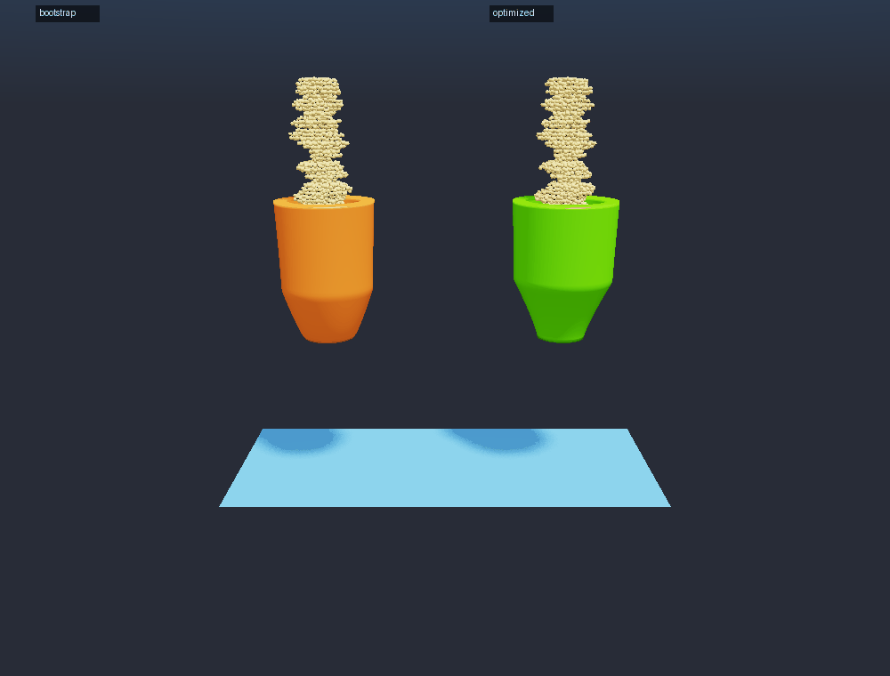
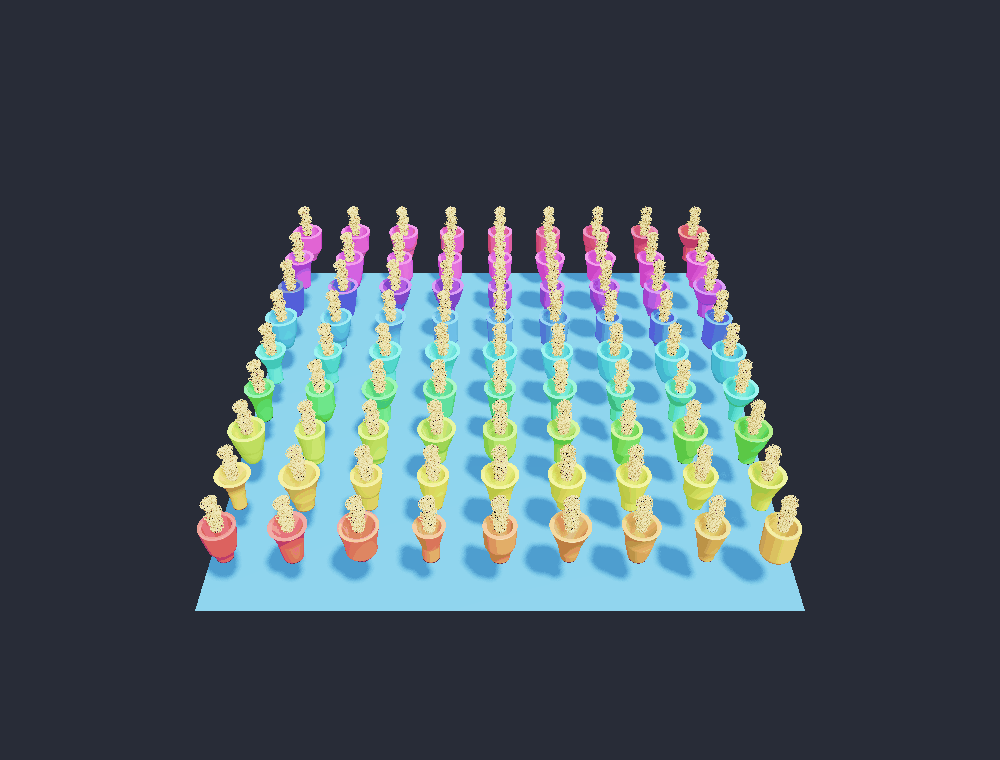
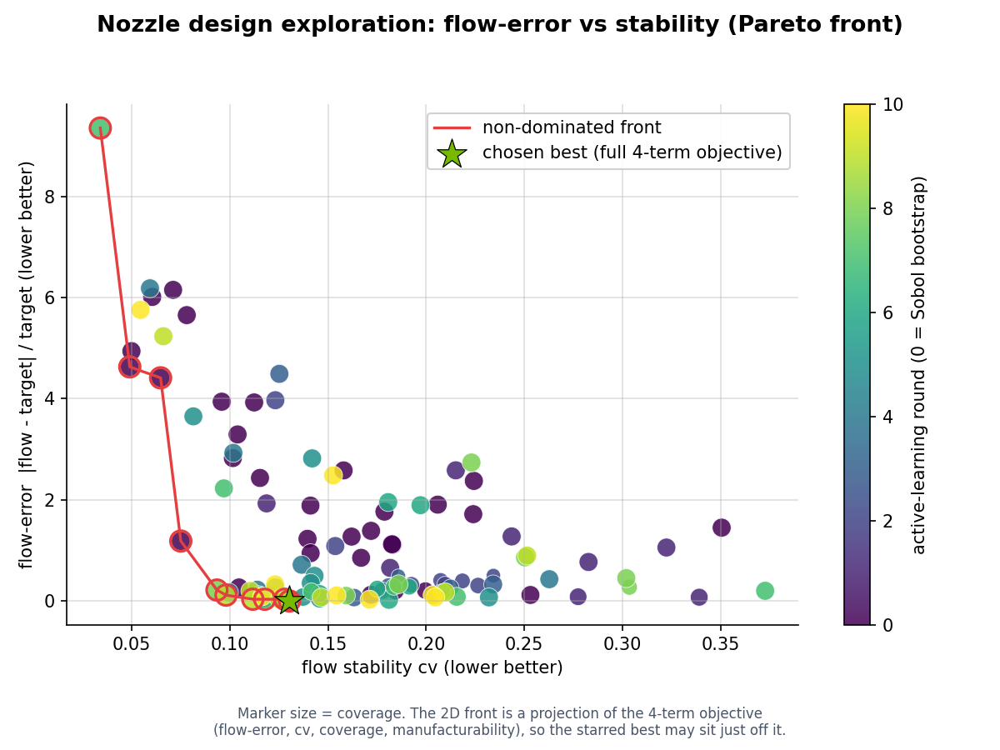

<!-- markdownlint-disable MD033 -->
# MPM nozzle inverse-design (simulator as oracle)

Part of the [Newton + PhysicsNeMo examples](../README.md); start there if
Newton or PhysicsNeMo is new to you.

PhysicsNeMo gives you reusable tools for turning a physics simulator into a
design optimizer. This example is one such workflow. It uses Newton's
material-point-method (MPM) fluid solver as a black-box oracle and lets a
PhysicsNeMo active-learning loop discover a good nozzle geometry while spending
as few expensive simulations as possible.

It is a worked example of the **Newton + PhysicsNeMo integration**: the same
active-learning loop applies to any expensive, non-differentiable simulator
you want to optimize against. It complements the
[diffsim cart-pole example](../diffsim/): there a learned surrogate is trained
from solver trajectories, while here Newton's implicit-MPM solver is treated as
a black box that returns only a score.

## The problem

A nozzle is a shaped pipe that turns a messy upstream feed of material into a
controlled downstream flow. We want to find the nozzle *shape* that produces a
steady, on-target flow rate.

The Newton scene fixes a messy inlet charge above the nozzle and asks for the
geometry that turns that feed into a smooth, on-target downstream mass flow.
Every candidate uses the exact same inlet charge, so the optimizer can only
improve the shape of the nozzle, not the feed. The implicit-MPM solver steps
each design until the charge drains, and the scene measures the normalized
mass-flow rate through a plane below the nozzle along with its stability
(coefficient of variation), spread, and coverage. A combined objective rewards
a flow rate near the target with low variation and good coverage, plus a small
engineering penalty for unmanufacturable profiles such as steep wall slopes or a
too-narrow aperture.

The design space is 6 interpretable engineering parameters: three radii (`r_top`
inlet, `r_meter` throat, `r_aperture` exit), a metering-height fraction
`z_meter_frac`, and two curvature exponents (`lower_exponent`, `upper_exponent`)
that shape the contraction above and below the throat. These map to a monotone
surface-of-revolution radius profile r(z).

Why is this hard? Each MPM simulation is the dominant cost, and the solver only
ever returns a scalar score for a design, never a gradient. So we cannot run
gradient descent on the geometry. The goal is to find the best design using as
few MPM evaluations as possible.

## How the workflow solves it

PhysicsNeMo's answer is to train a cheap surrogate model that predicts the score
from a design, and use it to decide which designs are worth the expensive
simulator. The reusable loop is
`physicsnemo.experimental.integrations.newton.optimize_design`.

The physics half lives next to the example in `nozzle_scene.py`, which builds the
geometry, emits the fixed inlet charge, batches several worlds into one Newton
model, runs `SolverImplicitMPM`, and returns the flow-quality objective. The
example file only declares the problem-specific pieces: the design bounds, the
oracle callable, and the report.

The loop alternates two stages.

1. **Bootstrap with coverage.** A scrambled low-discrepancy Sobol batch over the
   unit cube seeds the surrogate with a well-spread set of designs. Each
   unit-cube point is mapped to a valid design that keeps
   `aperture <= meter <= inlet`, then simulated in Newton MPM (the oracle).
2. **Surrogate-guided acquisition.** A `FullyConnected` surrogate (wrapped in
   `DesignSurrogate`, with target standardization and a small AdamW/MSE fit) is
   refit on every evaluated design so far. It scores a large Sobol candidate
   pool, then sends the best-predicted designs plus a small exploration sample
   back to Newton. The surrogate is refit after each Newton batch.

This is exactly the regime the simulator-as-oracle loop is designed for:
the simulator is expensive and gives no gradient, so a fast surrogate is used to
spend that budget wisely. The total oracle budget is
`bootstrap + rounds * num_worlds` MPM design evaluations, batched `num_worlds`
designs per Newton model.

## Getting started

### Prerequisites

The example uses Newton's implicit-MPM solver. Install the PhysicsNeMo `newton`
extra, then run from the repository root:

```bash
uv run python examples/newton/nozzle/example_mpm_nozzle_design.py
```

`nozzle_scene.py` is a local sibling module imported by the example, so keep the
two files in this folder together. By default the MPM oracle runs on Warp's
default device (the GPU when one is visible). Use `--newton-device` for the MPM
solve and `--torch-device` for the surrogate (the tiny surrogate defaults to
CPU). The companion `render_nozzle.py` accepts the same `--newton-device` flag.

### Running

Full (best-performance) run. This spends a larger oracle budget for a converged
active-learning curve and a clean surrogate-parity plot:

```bash
uv run python examples/newton/nozzle/example_mpm_nozzle_design.py \
    --save-pareto-data \
    --num-worlds 8 --bootstrap 32 --rounds 10 \
    --surrogate-epochs 400 --hidden-dim 192 --depth 4 \
    --sim-time 1.5 --fps 90 --substeps 6 --max-iterations 260 --voxel-size 0.010
```

Fast smoke check (reduced MPM fidelity, for an end-to-end sanity run):

```bash
uv run python examples/newton/nozzle/example_mpm_nozzle_design.py \
    --num-worlds 4 --bootstrap 8 --rounds 2 \
    --sim-time 0.6 --fps 60 --substeps 4 --max-iterations 80
```

Each run writes `nozzle_design_report.md` and
`newton_nozzle_design.png` to `outputs/nozzle/` inside this folder (from the
repository root, `examples/newton/nozzle/outputs/nozzle/`). The render and
Pareto scripts use the same output directory. Use `--output-dir`/`--media-dir`
on the example and renderer, or `--out` on `plot_pareto.py`, to choose another
location. Pass `--help` for the full flag list.
`--target-flow` sets the desired normalized mass-flow rate (default 0.75).

Pass `--save-pareto-data` to also write `outputs/nozzle/pareto_data.npz`, which
the two companion scripts consume to produce the figures below:

```bash
# the batched-worlds and before/after renders
uv run python examples/newton/nozzle/render_nozzle.py \
  --view worlds --num-worlds 81
uv run python examples/newton/nozzle/render_nozzle.py --view before-after
# the Pareto-front exploration plot
uv run python examples/newton/nozzle/plot_pareto.py
```

## Results

The full run uses 112 Newton MPM evaluations over 10 active-learning rounds. The
best-so-far objective drops from 0.3124 at bootstrap to 0.1231, and the best
design lands at a normalized flow rate of 0.751 against a target of 0.75, with
flow stability (cv) 0.130 and coverage 0.982.

The scorecard below shows the four panels written by the run: active-learning
convergence (best objective versus round), surrogate parity (Newton-measured
objective versus surrogate prediction on the evaluated designs), the optimized
nozzle cross-section, and the achieved flow rate versus the target.

")

### Before and after optimization

The bootstrap design (the best of the initial Sobol batch, orange) next to the
optimized best design (green), each draining the identical inlet charge. The
optimized throat meters the flow toward the target rate.



### Batched design worlds

The active-learning loop scores candidate designs by simulating them as parallel
Newton worlds. Here are 81 of the early, diverse designs running together on a
shared ground, each nozzle a different color, all advanced by one batched MPM
solve. This batching is what makes spending the expensive solver on a whole
query round at once practical.



### Design-space exploration (Pareto front)

Every Newton MPM evaluation is one point below, flow-error against stability,
colored by active-learning round. Round 0 is the diverse Sobol bootstrap, and
later rounds are surrogate-guided and concentrate near the front. The red curve
is the non-dominated front and the star is the chosen best. The 2D view is a
projection of the full four-term objective (flow-error, stability, coverage, and
a manufacturability penalty), so the chosen best can sit just off the 2D front.



## References

- [Newton physics engine](https://github.com/newton-physics/newton)
- [NVIDIA Warp](https://github.com/NVIDIA/warp)
- [Material point method (MPM)](https://en.wikipedia.org/wiki/Material_point_method)
- [Sobol sequences (low-discrepancy sampling)](https://en.wikipedia.org/wiki/Sobol_sequence)
