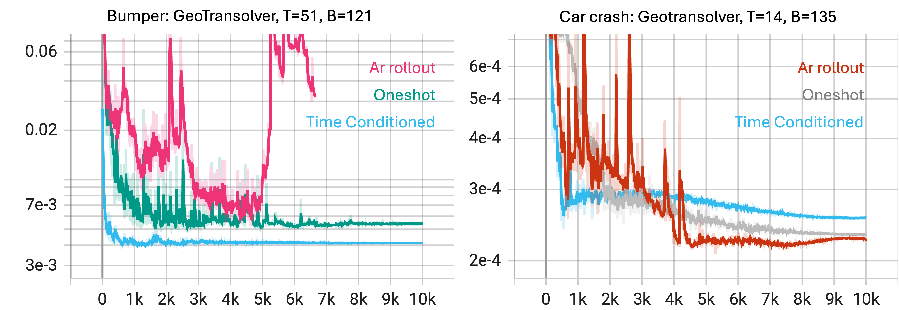
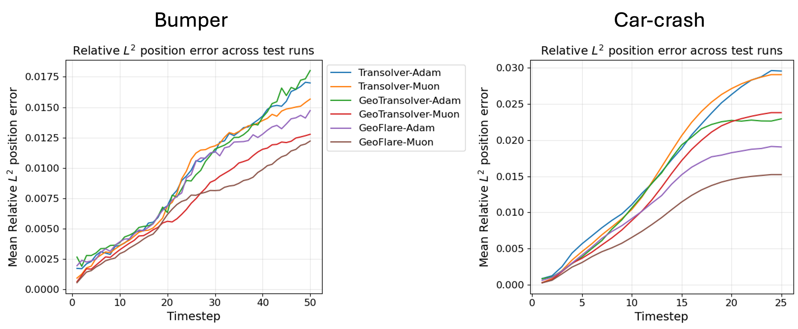

<!-- markdownlint-disable -->
# Machine Learning Surrogates for Automotive Crash Dynamics 🧱💥🚗

## Problem Overview

Automotive crashworthiness assessment is a critical step in vehicle design. Traditionally, engineers rely on high-fidelity finite element (FE) simulations (e.g., LS-DYNA) to predict structural deformation and crash responses. While accurate, these simulations are computationally expensive and limit the speed of design iterations.

Machine Learning (ML) surrogates provide a promising alternative by learning mappings directly from simulation data, enabling rapid prediction of deformation histories across thousands of design candidates.

In this recipe, we demonstrate a unified pipeline for crash dynamics modeling. The implementation supports GeoTransolver, Transolver, MeshGraphNet, and FIGConvUNet architectures with multiple rollout schemes. It supports VTP and Zarr formats (preprocessed from LS-DYNA d3plot via PhysicsNeMo-Curator). The design is highly modular, enabling users to write their own readers, bring their own architectures, or implement custom rollout/transient schemes. Multiple experiments (different datasets, models, or feature sets) are managed via Hydra experiment configs without touching the core code.

For an in-depth comparison between the Transolver and MeshGraphNet models and the transient schemes for crash dynamics, see [this paper](https://arxiv.org/pdf/2510.15201).

### Body-in-White Crash Modeling

<p align="center">
  

</p>

### Crushcan Modeling

<p align="center">
  

</p>

### Bumper Beam modeling

<p align="center">
  

</p>


## Prerequisites

**Data:** LS-DYNA crash data preprocessed to VTP or Zarr format using [PhysicsNeMo-Curator](https://github.com/NVIDIA/physicsnemo-curator/tree/main/examples/structural_mechanics/crash). See [Data Preprocessing](#data-preprocessing) below for setup instructions.

**Code dependencies:**

```bash
pip install -r requirements.txt
```

For graph-based models (e.g., MeshGraphNet) or the graph datapipe, install the PhysicsNeMo `gnns` extra:

```bash
pip install "nvidia-physicsnemo[gnns]"
# or with uv:
uv sync --extra gnns
```

## Data Preprocessing

Using `PhysicsNeMo-Curator`, crash simulation data from LS-DYNA can be processed into training-ready formats easily.
PhysicsNeMo-Curator can preprocess d3plot files into **VTP** (for visualization and smaller datasets) or **Zarr** (for large-scale ML training).

Install PhysicsNeMo-Curator following
[these instructions](https://github.com/NVIDIA/physicsnemo-curator?tab=readme-ov-file#installation-and-usage).

Process your LS-DYNA data to **VTP format**:

```bash
export PYTHONPATH=$PYTHONPATH:examples &&
physicsnemo-curator-etl                                         \
    --config-dir=examples/structural_mechanics/crash/config     \
    --config-name=crash_etl                                     \
    serialization_format=vtp                                    \
    etl.source.input_dir=/data/crash_sims/                      \
    serialization_format.sink.output_dir=/data/crash_vtp/       \
    etl.processing.num_processes=4
```

Or process to **Zarr format** for large-scale training:

```bash
export PYTHONPATH=$PYTHONPATH:examples &&
physicsnemo-curator-etl                                         \
    --config-dir=examples/structural_mechanics/crash/config     \
    --config-name=crash_etl                                     \
    serialization_format=zarr                                   \
    etl.source.input_dir=/data/crash_sims/                      \
    serialization_format.sink.output_dir=/data/crash_zarr/      \
    etl.processing.num_processes=4
```

The Curator expects your LS-DYNA data organized as:

```
crash_sims/
├── Run100/
│   ├── d3plot          # Required: binary mesh/displacement data
│   └── run100.k        # Optional: part thickness definitions
├── Run101/
│   ├── d3plot
│   └── run101.k
└── ...
```

### Output Formats

#### VTP Format

Produces single VTP file per run with all timesteps as displacement fields:

```
crash_processed_vtp/
├── Run100.vtp
├── Run101.vtp
└── ...
```

Each VTP contains:
- Reference coordinates at t=0
- Displacement fields: `displacement_t0.000`, `displacement_t0.005`, etc.
- Node thickness and other point data features

This format is directly compatible with the VTP reader in this example.

#### Zarr Format

Produces one Zarr store per run with pre-computed graph structure:

```
crash_processed_zarr/
├── Run100.zarr/
│   ├── mesh_pos       # (timesteps, nodes, 3) - temporal positions
│   ├── thickness      # (nodes,) - node features
│   └── edges          # (num_edges, 2) - pre-computed graph connectivity
├── Run101.zarr/
└── ...
```

Each Zarr store contains:
- `mesh_pos`: Full temporal trajectory (no displacement reconstruction needed)
- `thickness`: Per-node features
- `edges`: Pre-computed edge connectivity (no edge rebuilding during training)

**NOTE:** All heavy preprocessing (node filtering, edge building, thickness computation) is done once during curation using PhysicsNeMo-Curator. The reader simply loads pre-computed arrays.

This format is directly compatible with the Zarr reader in this recipe.

## Training

Training is managed via Hydra configurations located in `conf/`.
The main script is `train.py`.

### Config Structure

```
conf/
├── bumper_geotransolver_oneshot.yaml       # ← self-contained experiment configs
├── bumper_geotransolver_time_conditional.yaml
├── crash_geotransolver_oneshot.yaml
├── bumper_geoflare_oneshot.yaml
├── crash_geoflare_oneshot.yaml
├── datapipe/                              # dataset configs (generic defaults)
│   ├── graph.yaml
│   └── point_cloud.yaml
├── model/                                 # model configs
│   ├── geotransolver_one_shot.yaml
│   ├── geotransolver_autoregressive_rollout_training.yaml
│   ├── geotransolver_one_step_rollout.yaml
│   ├── geotransolver_time_conditional.yaml
│   ├── transolver_one_shot.yaml
│   ├── figconvunet_one_shot.yaml
│   ├── mgn_one_shot.yaml
│   └── ...
├── reader/                                # reader configs
│   ├── vtp.yaml
│   └── zarr.yaml
├── training/default.yaml                  # generic training hyperparameters
└── inference/default.yaml                 # generic inference options
```

Each experiment config is self-contained with its own defaults for reader, datapipe, model, training, and inference. All experiment-specific settings (data paths, dataset sizes, feature lists) are defined directly in the experiment config file.

### Launch Training

Single GPU:

```bash
python train.py --config-name=bumper_geotransolver_oneshot
```

Multi-GPU (Distributed Data Parallel):

```bash
torchrun --nproc_per_node=<NUM_GPUS> train.py --config-name=bumper_geotransolver_oneshot
```

## Inference

Use `inference.py` to evaluate trained models on test crash runs. Outputs are written under `output_dir_pred/rank{N}/{run_name}/`.

**Note:** Inference currently supports only the VTP format.

Single GPU:

```bash
python inference.py --config-name=bumper_geotransolver_oneshot
```

Multi-GPU (Distributed Data Parallel):

```bash
torchrun --nproc_per_node=<NUM_GPUS> inference.py --config-name=bumper_geotransolver_oneshot
```

Runs are sharded across ranks: rank `r` processes `run_items[r::world_size]`.
Predicted meshes are written as .vtp files under `./predicted_vtps/`, and can be opened using ParaView.

## Experiments

Each experiment is a self-contained YAML file in `conf/`. Each config file includes all defaults and experiment-specific settings.

### Anatomy of an experiment config

Data paths must be set either in the config file or via CLI overrides. For training: `raw_data_dir`, `raw_data_dir_validation`. For inference: `raw_data_dir_test`. Use `???` in the config to make them mandatory overrides, or set concrete paths directly.

```yaml
# conf/my_experiment.yaml

hydra:
  job:
    chdir: True
  run:
    dir: ./outputs/

experiment_name: "My-Experiment"

defaults:
  - reader: vtp
  - datapipe: point_cloud
  - model: geotransolver_one_shot
  - training: default
  - inference: default
  - _self_

# ┌───────────────────────────────────────────┐
# │                   Data                    │
# └───────────────────────────────────────────┘

training:
  raw_data_dir: ???              # set in config or via CLI
  raw_data_dir_validation: ???   # set in config or via CLI
  global_features_filepath: ???  # or null if not using global features
  num_time_steps: 51
  num_training_samples: 121
  num_validation_samples: 5

inference:
  raw_data_dir_test: ???         # set in config or via CLI

# ┌───────────────────────────────────────────┐
# │            Datapipe features              │
# └───────────────────────────────────────────┘

datapipe:
  static_features: []  # per-node static features (e.g., thickness)
  dynamic_targets:    # per-node time-series targets (e.g., strain, stress)
    - effective_plastic_strain
    - stress_vm
  global_features:   # per-run scalar features (loaded from JSON)
    - velocity_x
    - thickness_scale
    - rwall_origin_y
  sample_type: all_time_steps  # or one_time_step for time-conditional models
```

### Provided experiments

| File | Dataset | Model | Launch command |
|------|---------|-------|----------------|
| `bumper_geotransolver_oneshot.yaml` | Bumper beam (VTP) | GeoTransolver one-shot | `python train.py --config-name=bumper_geotransolver_oneshot` |
| `bumper_geotransolver_time_conditional.yaml` | Bumper beam (VTP) | GeoTransolver time-conditional | `python train.py --config-name=bumper_geotransolver_time_conditional` |
| `crash_geotransolver_oneshot.yaml` | Car body-in-white crash (VTP) | GeoTransolver one-shot | `python train.py --config-name=crash_geotransolver_oneshot` |
| `bumper_geoflare_oneshot.yaml` | Bumper beam (VTP) | GeoFLARE one-shot | `python train.py --config-name=bumper_geoflare_oneshot` |
| `crash_geoflare_oneshot.yaml` | Car body-in-white crash (VTP) | GeoFLARE one-shot | `python train.py --config-name=crash_geoflare_oneshot` |

### Choosing a time scheme

Two rollout schemes are supported, selected by the experiment config (model + datapipe):

| Scheme | Model | Datapipe `sample_type` | Behavior |
|--------|-------|------------------------|----------|
| **One-shot** | `geotransolver_one_shot` | `all_time_steps` | One sample per run. Model predicts the full trajectory `[N, T-1, Fo]` from t0 in a single forward pass. Lower training cost, competitive accuracy. |
| **Time-conditional** | `geotransolver_time_conditional` | `one_time_step` | One sample per run per timestep. Model predicts a single step `[N, Fo]` conditioned on normalized time `t/(T-1)`. Best accuracy for long horizons; higher training cost. Inference always rolls out the full trajectory. |

Use **one-shot** when you need fast iteration or have limited compute. Use **time-conditional** when validation quality matters most. See [Development tips](#development-tips) for a comparison table.

Two additional schemes are available in the rollout (`geotransolver_autoregressive_rollout_training`, `geotransolver_one_step_rollout`) but are not provided as premade experiment configs. You can enable them by selecting the corresponding model in `conf/model/` and configuring the datapipe accordingly.

### Adding a new experiment

1. Create `conf/<my_experiment>.yaml` following the template above.
2. Set defaults for reader, datapipe, model, training, and inference in the `defaults` section.
3. Set all required fields: `raw_data_dir`, `raw_data_dir_validation` (training), `raw_data_dir_test` (inference), `num_time_steps`, `num_training_samples`. Either set concrete paths in the config or use `???` and pass them via CLI when launching `train.py` or `inference.py` as appropriate.
4. Set `datapipe.sample_type` to match your model: `all_time_steps` for one-shot, `one_time_step` for time-conditional.
5. If using global features, set `global_features_filepath`; otherwise use `null`.
6. Optionally override any model or training hyperparameter directly in the experiment file (e.g., `model.out_dim: 150`, `training.epochs: 5000`), or add a new model config under `conf/model/` and select it in the defaults.
7. Run: `python train.py --config-name=<my_experiment>`

You can also override the model in the `defaults` section. For time-conditional training, use the dedicated experiment config:
```yaml
# Use bumper_geotransolver_time_conditional.yaml, or in your experiment:
defaults:
  - reader: vtp
  - model: geotransolver_time_conditional  # Override model
  - training: default
  - _self_
```

## Datapipe: how inputs are constructed and normalized

The datapipe converts reader output into model-ready `SimSample`s. Each sample is one crash run (or one timestep of a run, depending on `sample_type`).

Inputs `x` contain `x['coords']` (`[N, 3]` at t0) and `x['features']` (`[N, F]` static plus flattened dynamic features in config order). Targets `y` have shape `[N, T-1, Fo]` where Fo=3 for positions only, or 3+sum(C_k) if `dynamic_targets` is set (e.g. strain, stress).

Config lives under `conf/datapipe/`. Two variants exist: `graph` for MeshGraphNet and `point_cloud` for point cloud-based models (e.g., GeoTransolver and Transolver). Both use `static_features` (e.g. `[thickness]`), `dynamic_features`, `dynamic_targets`, and `global_features`. Use `static_features: []` for no node features. Position and feature stats are computed on the train split, saved to `./stats/` (`node_stats.json`, `feature_stats.json`, `edge_stats.json` for graph), and reused at eval and inference.

### Sample type: all_time_steps vs one_time_step

The datapipe `sample_type` (set in each experiment's `datapipe` block) controls how samples are constructed to match the model's rollout scheme:

- **`all_time_steps`** (one-shot): One sample per run. `x` has `coords` and `features`; `y` is the full trajectory `[N, T-1, Fo]`. Dataset length = `num_samples`.

- **`one_time_step`** (time-conditional): One sample per run per timestep. Each sample corresponds to `(batch_idx, time_idx)`; `x` adds `x['time']` = `time_idx/(T-1)` (normalized); `y` is a single step `[N, Fo]`. Dataset length = `num_samples * (T-1)`. Inference always uses `all_time_steps`, so it receives full trajectories.

Readers return `(srcs, dsts, point_data)`; see the [Reader](#reader-built-in-vtp-and-zarr-readers-and-how-to-add-your-own) section. The graph datapipe builds PyG `Data` with edge features from t0 positions; the point-cloud datapipe ignores connectivity. Models consume `x['coords']` and `x['features']` directly. The `_feature_slices` map associates feature names with column ranges for diagnostics. With `static_features: []`, the features tensor has width zero and the pipeline handles it correctly.

### Global features

Global features are per-run scalar values (e.g., impact velocity, thickness scale factor, wall position) that do not vary across mesh nodes. They are passed to the model as a single global conditioning vector and are distinct from the per-node `features` described above.

#### JSON file format

Global features are stored in a single JSON file shared across all splits (train, validation, test). The file is a flat dictionary keyed by **run ID**, where each value is a dictionary of `{feature_name: scalar_float}`:

```json
{
  "Run100": {
    "velocity_x": -5.0,
    "thickness_scale": 1.0,
    "rwall_origin_y": 0.0
  },
  "Run101": {
    "velocity_x": -5.0,
    "thickness_scale": 0.7,
    "rwall_origin_y": 120.0
  },
  ...
}
```

**Run ID convention:** the run ID must match the **filename stem** of the corresponding data file. For the VTP reader, a file named `Run100.vtp` maps to run ID `"Run100"`. For the Zarr reader, a store named `Run100.zarr/` maps to run ID `"Run100"`. All values must be Python-serializable floats (or ints, which are cast to float).

#### Configuration

Point to the JSON file and declare which keys to use in your experiment config. Set `global_features_filepath` in the config file or via CLI (`training.global_features_filepath=/path/to/global_features.json`):

```yaml
# conf/my_experiment.yaml
training:
  global_features_filepath: ???  # or a concrete path

datapipe:
  global_features:       # subset of keys to extract; order defines the global vector
    - velocity_x
    - thickness_scale
    - rwall_origin_y
```

Every run in the dataset must have **all listed keys** present in the JSON; a missing key raises a `KeyError` at dataset construction time. Keys present in the JSON but not listed in `global_features` are silently ignored, so you can store extra metadata in the file without affecting training.

To disable global features entirely, omit `global_features_filepath` (or leave it `null`) and set `global_features: null` in the datapipe block.

#### How the datapipe and model consume global features

At `__getitem__` time, the datapipe converts the selected scalars to a dict of scalar tensors and attaches them to the `SimSample`:

```python
sample.global_features = {
    "velocity_x":      tensor(-5.0),
    "thickness_scale": tensor(1.0),
    "rwall_origin_y":  tensor(0.0),
}
```

In the model forward pass, these are stacked into a single global embedding vector and passed to the network. The **`global_dim`** parameter in the model config must equal the number of global features selected:

```yaml
# conf/model/geotransolver_one_shot.yaml (or in experiment model overrides)
global_dim: 3   # must match len(datapipe.global_features)
```

If `global_features` is `null`, `sample.global_features` is `None` and the model must handle this case (currently only `GeoTransolverOneShot` uses global features; other models ignore them).

## Reader: built-in VTP and Zarr readers and how to add your own

The reader opens preprocessed simulation data and produces the arrays the datapipe consumes. Raw LS-DYNA d3plot files must be preprocessed to VTP or Zarr using [PhysicsNeMo-Curator](https://github.com/NVIDIA/physicsnemo-curator/tree/main/examples/structural_mechanics/crash) before use. The reader is swappable via Hydra so you can adapt the pipeline to different formats or add your own.

### Built‑in VTP reader (PolyData)

A lightweight VTP reader is provided in `vtp_reader.py`. It treats each `.vtp` file in a directory as a separate run and expects point displacements to be stored as vector arrays in `poly.point_data` with names like `displacement_t0.000`, `displacement_t0.005`, … (a more permissive fallback of any `displacement_t*` is also supported). The reader:

- loads the reference coordinates from `poly.points`
- builds absolute positions per timestep as `[t0: coords, t>0: coords + displacement_t]`
- extracts cell connectivity from the PolyData faces and converts it to unique edges
- extracts all point data fields dynamically (e.g., thickness, modulus)
- returns `(srcs, dsts, point_data)` where `point_data` contains `'coords': [T, N, 3]` and all feature arrays

The VTP reader dynamically extracts all non-displacement point data fields from the VTP file and makes them available to the datapipe. If your `.vtp` files include additional per‑point arrays (e.g., thickness or modulus), simply add their names to the `features` list in your datapipe config.

Example Hydra configuration for the VTP reader:

```yaml
# conf/reader/vtp.yaml
_target_: vtp_reader.Reader
```

Select it in your experiment config defaults:

```yaml
# conf/my_experiment.yaml
defaults:
  - reader: vtp
  - datapipe: point_cloud
  - model: geotransolver_one_shot
  - training: default
  - inference: default
  - _self_
```

And configure features in the experiment's `datapipe` block:

```yaml
# conf/my_experiment.yaml
datapipe:
  static_features: [thickness]  # or [] for no features
```

### Built‑in Zarr reader

A Zarr reader provided in `zarr_reader.py`. It reads pre-processed Zarr stores created by PhysicsNeMo-Curator, where all heavy computation (node filtering, edge building, thickness computation) has already been done during the ETL pipeline. The reader:

- loads pre-computed temporal positions directly from `mesh_pos` (no displacement reconstruction)
- loads pre-computed edges (no connectivity-to-edge conversion needed)
- dynamically extracts all point data fields (thickness, etc.) from the Zarr store
- returns `(srcs, dsts, point_data)` similar to VTP reader

Data layout expected by Zarr reader:
- `<DATA_DIR>/*.zarr/` (each `.zarr` directory is treated as one run)
- Each Zarr store must contain:
  - `mesh_pos`: `[T, N, 3]` temporal positions
  - `edges`: `[E, 2]` pre-computed edge connectivity
  - Feature arrays (e.g., `thickness`): `[N]` or `[N, K]` per-node features

Example Hydra configuration for the Zarr reader:

```yaml
# conf/reader/zarr.yaml
_target_: zarr_reader.Reader
```

Select it in your experiment config defaults:

```yaml
# conf/my_experiment.yaml
defaults:
  - reader: zarr
  - datapipe: point_cloud
  - model: geotransolver_one_shot
  - training: default
  - inference: default
  - _self_
```

And configure features in the experiment's `datapipe` block:

```yaml
# conf/my_experiment.yaml
datapipe:
  static_features: [thickness]  # Must match fields stored in Zarr
```

### Data layout expected by readers

- VTP reader (`vtp_reader.py`):
  - `<DATA_DIR>/*.vtp` (each `.vtp` is treated as one run)
  - Displacements stored as 3‑component arrays in point_data with names like `displacement_t0.000`, `displacement_t0.005`, ... (fallback accepts any `displacement_t*`).

- Zarr reader (`zarr_reader.py`):
  - `<DATA_DIR>/*.zarr/` (each `.zarr` directory is treated as one run)
  - Contains pre-computed `mesh_pos`, `edges`, and feature arrays

### Write your own reader

To write your own reader, implement a Hydra‑instantiable function or class whose call returns a three‑tuple `(srcs, dsts, point_data)`. The first two entries are lists of integer arrays describing edges per run (they can be empty lists if you are not producing a graph), and `point_data` is a list of Python dicts with one dict per run. Each dict must contain `'coords'` as a `[T, N, 3]` array and one array per feature name listed in `conf/datapipe/*.yaml` under `features`. Feature arrays can be `[N]` or `[N, K]` and should use the same node indexing as `'coords'`. For convenience, a simple class reader can accept the Hydra `split` argument (e.g., "train" or "test") and decide whether to save VTP frames, but this is optional.

As a starting point, your YAML can point to a class by dotted path:

```yaml
# conf/reader/my_reader.yaml
_target_: my_reader.MyReader
# any constructor kwargs here, e.g. thresholds or unit conversions
```

Then, in your experiment config, select the reader by adding `- reader: my_reader` to the `defaults` block. The datapipe will call your reader with `data_dir`, `num_samples`, `split`, and an optional `logger`, and will expect the tuple described above. Provided you populate `'coords'` and the configured feature arrays per run, the rest of the pipeline—normalization, batching, graph construction, and model rollout—will work without code changes.

A note on reader signatures and future‑proofing: the datapipe currently passes `data_dir`, `num_samples`, `split`, and `logger` when invoking the reader, and may pass additional keys in the future. To stay resilient, implement your reader with optional parameters and a catch‑all `**kwargs`.

For a class reader, use this signature in `__call__`:

```python
class MyReader:
    def __init__(self, some_option: float = 1.0):
        self.some_option = some_option

    def __call__(
        self,
        data_dir: str,
        num_samples: int,
        split: str | None = None,
        logger=None,
        **kwargs,
    ):
        ...
```

With this pattern, your reader will keep working even if the framework adds new optional arguments later.

## Postprocessing and Evaluation

The postprocessing/ folder provides scripts for quantitative and qualitative evaluation:

- Relative $L^2$ Error (compute_l2_error.py): Computes
per-timestep relative position error across runs.
Produces plots and optional CSVs.

Example:

```bash
python postprocessing/compute_l2_error.py \
    --predicted_parent ./predicted_vtps \
    --exact_parent ./exact_vtps \
    --output_plot rel_error.png \
    --output_csv rel_error.csv
```

- Probe Kinematics (Driver vs Passenger Toe Pan)(compute_probe_kinematics.py):
Extracts displacement/velocity/acceleration histories at selected probe nodes.
Generates comparison plots (GT vs predicted).

Example:

```bash
python postprocessing/compute_probe_kinematics.py \
    --pred_dir ./predicted_vtps/run_001 \
    --exact_dir ./exact_vtps/run_001 \
    --driver_points "70658-70659,70664" \
    --passenger_points "70676-70679" \
    --dt 0.005 \
    --output_plot probe_kinematics.png
```

- Cross-Sectional Plots (plot_cross_section.py): Plots 2D slices
of predicted vs ground truth deformations at specified cross-sections.

Example:

```bash
python postprocessing/plot_cross_section.py \
    --pred_dir ./predicted_vtps/run_001 \
    --exact_dir ./exact_vtps/run_001 \
    --output_file cross_section.png
```

run_post_processing.sh can automate all evaluation tasks across runs.

## Development tips

### Dynamics prediction

1. **Time-conditional** gives the best accuracy for long-horizon dynamics; prefer it when validation quality matters most.
2. **One-shot** offers competitive accuracy with much lower training cost; consider it when you need fast iteration or have few state variables to predict.
3. **AR-rollout** can work well for short-horizon prediction but tends to become unstable when training for longer rollouts.
4. **Teacher-forcing** yields low training loss but typically generalizes poorly at inference; avoid it for deployment.


| Bumper(T=50)      | t/epoch (sec) | Validation MSE | Car crash (T=14)  | t/epoch (sec) | Validation MSE |
|:------------------|:--------:|:--------:|:------------------|:--------:|:--------:|
| One-shot          | 1        | 5.42e-3  | One-shot          | 6.4      | 2.32e-4  |
| Time-conditional  | 29       | 4.12e-3  | Time-conditional  | 40.8     | 2.54e-4  |
| AR-rollout        | 37       | unstable | AR-rollout        | 61.6     | 2.27e-4  |
| Teacher-forcing   | 29       | 0.3      |                   |          |          |

<p align="center">
  

</p>

### Models

5. **Accuracy ranking (one-shot):** GeoFlare > GeoTransolver > Transolver > MeshGraphNet. Use GeoFlare when best accuracy is the priority.
6. **Muon** generally outperforms Adam on validation MSE but can overfit; monitor validation loss and consider early stopping or regularization.

**One-shot comparison:**

| Test Relative L^2 | Bumper(Adam)   | Bumper(Muon) | Car crash(Adam)   | Car crash(Muon)|
|:------------------|:--------:|:--------:|:--------:|:--------:|
| Transolver        | 9.37e-3  | 9.12e-3  | 1.60e-2  | 1.60e-2  |
| GeoTransolver     | 9.40e-3  | 7.32e-3  | 1.40e-2  | 1.33e-2  |
| GeoFlare          | **8.73e-3**  | **6.80e-3**  | **1.16e-2**  | **8.95e-3**  |

Adam: Car-crash test MSE at probe location (Driver, Passenger):

| Driver            | position   | velocity | acceleration | Passenger   | position   | velocity | acceleration | 
|:------------------|:--------:|:--------:|:--------:|:------------------|:--------:|:--------:|:--------:|
| Transolver        | 2.21e-3  | 8.21e-1  | 5.60e+3  | Transolver        | 2.43e-3  | 9.31e-1  | 6.81e+3  |
| GeoTransolver     | 1.51e-3  | 5.74e-1  | 3.99e+3  | GeoTransolver     | 1.92e-3  | 7.03e-1  | 5.53e+3  |
| GeoFlare          | **1.01e-3**  | **4.38e-1**  | **2.99e+3**  | GeoFlare          | **1.19e-3**  | **5.16e-1**  | **3.93e+3**  |


Muon: Car-crash test MSE at probe location (Driver, Passenger):

| Driver            | position   | velocity | acceleration | Passenger   | position   | velocity | acceleration | 
|:------------------|:--------:|:--------:|:--------:|:------------------|:--------:|:--------:|:--------:|
| Transolver        | 2.63e-3  | 8.41e-1  | 2.14e+3  | Transolver        | 2.21e-3  | 7.25e-1  | 2.24e+3  |
| GeoTransolver     | 1.84e-3  | 6.09e-1  | 1.71e+3  | GeoTransolver     | 1.72e-3  | 5.53e-1  | 1.80e+3  |
| GeoFlare          | **7.18e-4**  | **2.71e-1**  | **1.27e+3**  | GeoFlare          | **6.52e-4**  | **2.53e-1**  | **1.45e+3**  |


<p align="center">
  

</p>

## TODO

- [ ] **Normalize global features**: Global features (e.g., velocity_x, thickness_scale, rwall_origin_y) are currently passed to the model without normalization. Add support for computing and applying per-feature mean/std (or similar) so global inputs are normalized consistently with node features and positions.
- [ ] **Normalize dynamic targets**: Dynamic targets (e.g., effective_plastic_strain, stress_vm) are currently passed in the target `y` without normalization, while positions are normalized. Add per-target mean/std and denormalize at inference when exporting to VTP.
- [ ] **Support batch_size > 1**: The pipeline currently uses `batch_size=1` due to variable node counts per sample. Add padding or batching logic to enable larger batch sizes for improved throughput.

## Troubleshooting / FAQ

- My `.vtp` has no displacement fields.
  - Ensure point_data contains vector arrays named like `displacement_t0.000`, `displacement_t0.005`, ...; the reader falls back to any `displacement_t*` pattern.

- I want no node features.
  - Set `features: []`. The datapipe will return `x['features']` with shape `[N, 0]`, and the rollout will still concatenate velocity (and time if configured) for the model input.

- Can functional_dim be 0 for Transolver?
  - It can be 0 only if the total MLP input dimension remains > 0: e.g., you provide an embedding (required for unstructured) and/or time. In this pipeline, rollout always supplies an embedding (positions), so you are safe with `features: []`.

- My custom reader doesn’t accept `split` or `logger`.
  - Implement `__call__(..., split: str | None = None, logger=None, **kwargs)` to remain forward‑compatible with optional arguments.

## References

- [Automotive Crash Dynamics Modeling Accelerated with Machine Learning](https://arxiv.org/pdf/2510.15201)
- [GeoTransolver: Learning Physics on Irregular Domains Using Multi-scale Geometry Aware Physics Attention Transformer](https://arxiv.org/pdf/2512.20399)]
- [Transolver: A Fast Transformer Solver for PDEs on General Geometries](https://arxiv.org/pdf/2402.02366)
- [Learning Mesh-Based Simulation with Graph Networks](https://arxiv.org/pdf/2010.03409)
